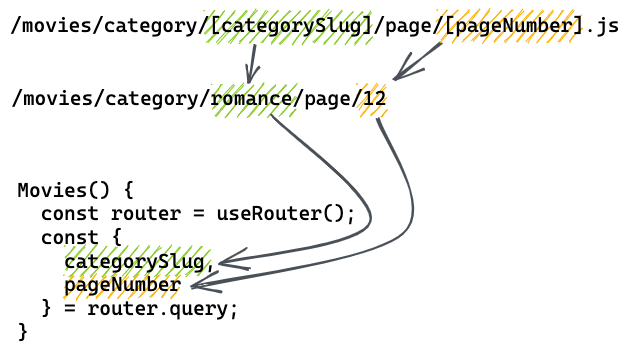

# Next.js - Overview

- [ ] [Basics and Routing](#nextjs-basics-and-routing)
- [ ] [Dynamic Routing](#nextjs-dynamic-routes)

# Next.js Basics and Routing

## Learning Objectives

- [ ] Knowing the difference between a library and a framework
- [ ] Understanding why Next.js is such a popular framework
- [ ] Knowing which features will be used during the bootcamp
- [ ] Understanding the basic concepts of Next.js:
  - [ ] Client-side routing
  - [ ] Page navigation with `next/link`
  - [ ] Image optimization with `next/image`

---

### Difference between a Library and a Framework

Next.js is a React framework, i.e. it is built on top of the React library. Both, a library as well as a framework, are reusable code written by someone else. Their purpose is to help you solve common problems in easier ways.

When using a library, you are in control which parts of the code you use and when. In contrast, a framework like Next.js is more rigid: you only have a few limited choices when and how to use the given code. If you accept these limitations, a framework takes a lot of work off your hands in the background.

### What is Next.js?

Next.js is a React framework that gives you building blocks to create fast web applications. These building blocks provide pre-built solutions for the main concepts you will encounter when building modern applications, such as user interface, routing, data fetching, infrastructure, etc.

> 📙 Read more about [N**ext.js** on the Next.js Homepage](https://nextjs.org/).

### Which Features of Next.js are we going to use in the Bootcamp?

Next.js will help us with the following topics:

- A template to use as a starting point
- A bundler, transpiler and development server
- Routing: Navigate between pages, Dynamic Routing
- Auto-optimized images
- API Routes

> 📙 Next.js has a lot more to offer, which is why it is such a popular framework. To get an impression of all features, [have a quick look at the documentation](https://nextjs.org/docs).

---

### How to Next.js: Basics

#### Differences to Create React App

Here you can see a comparison of some relevant differences between Next.js and Create React App (CRA):

|                        | Next.js (new)                    | Create React App (old) |
| ---------------------: | -------------------------------- | ---------------------- |
| Start local dev server | `npm run dev`                    | `npm run start`        |
|         Root component | `_app.js`                        | `App.js`               |
|               Document | `_document.js`                   | `public/index.html`    |
|        Default styling | CSS Modules\*                    | CSS\*                  |
|              Rendering | Server and Client Side           | Client Side            |
|       Route definition | file structure in `pages` folder | n/a                    |
|      Client side links | `<Link>` component               | n/a                    |
|     Image optimization | `<Image>` component              | n/a                    |
|     Modifying `<head>` | `<Head>` component               | n/a                    |
|           Font loading | `@next/font` package             | n/a                    |
|             API routes | `pages/api` folder               | n/a                    |
|                 ESLint | Next.js specific rules           | CRA specific rules     |
|   Bundler + transpiler | Webpack/Turbopack + SWC          | Webpack + Babel        |

\*Both Next.js and CRA support all modern styling solutions.

#### Server-Side Rendering

With CRA the browser loads an almost empty HTML document (`public/index.html`). Your React code is only executed in the browser.

Next.js comes with a featured called "server-side rendering". This feature will execute your React components on the server to send a complete HTML document to the client (the browser). On the client your React code gets executed again.

This enables a lot of optimization techniques we won't discuss. However, there is one important implication you need to know:

Since your React code is executed in a server environment and not just a browser environment, you need to pay attention when using browser APIs (like `window` or `document`). They are only available in the browser and will break the app on the server. When using a browser API you need to ensure that your code is only executed on the client. For example code inside a `useEffect` hook is only executed on the client, since effects are not executed on the server, but only on the client. Event handlers like `onClick` are also only executed on the client.

```jsx
useEffect(() => {
  console.log(window.innerWidth);
}, []);

return <button onClick={() => console.log(window.innerWidth)}>Click me</button>;
```

#### Routing

Until now our React applications only ever displayed a single page. The process of conditionally rendering different pages based on the URL (path name) and navigating between these pages ist called routing.

Since a good routing solution is not easy to make, almost all React developers rely on an external routing library. For example `react-router` is a very popular solution.

Next.js provides routing as a built-in feature, so that you don't need another library.

Routing in Next.js is based on the file system in the `pages` folder:

- `pages/index.js` → `/` (`index.js` always implies the root route of a folder)
- `pages/about.js` → `/about`

To support more complex routes, you can create the appropriate nested folder structure:

- `pages/about/me.js` → `/about/me`
- `pages/about/all-others.js` → `/about/all-others`
- `pages/about/some/long/route.js` → `/about/some/long/route`

> 💡 You can define dynamic routes (routes that have dynamic parameters) as well. This will be a topic of a future session.

> 💡 File based routing can be ambiguous. The files `pages/about/index.js` and `pages/about.js` are both associated with `/about`. In practice, this is rarely a problem. Nevertheless, you should be aware of it.

> 📙 Read more about [**Routing** in the Next.js Docs](https://nextjs.org/docs/routing/introduction).

#### `<Link>` component

For client-side transitions between routes, use the `<Link>` component provided by next/link. Given a `pages` directory with

- `pages/index.js`
- `pages/about.js`
- `pages/about/me.js`,

You can link to each of these pages in the following way:

```js
import Link from "next/link";

export default function Navigation() {
  return (
    <ul>
      <li>
        <Link href="/">Home</Link>
      </li>
      <li>
        <Link href="/about">About</Link>
      </li>
      <li>
        <Link href="/about/me">Me</Link>
      </li>
    </ul>
  );
}
```

> 📙 Read more about [**next/link** in the Next.js Docs](https://nextjs.org/docs/api-reference/next/link).

#### Image Optimaization with `next/image`

Next.js comes with automatic image optimization – the next/image component. This feature, for example, avoids shipping large images to devices with a smaller viewport and images are lazy-loaded by default. Keep in mind that using `<Image>` comes with a little bit of default styling.

Here's an example implementation. Note that the `height` and `width` props should be the desired rendering size, with an aspect ratio identical to the source image.

```js
import Image from "next/image";

export default function AnimalImage() {
  <Image
    src="/images/a_small_dog.jpg"
    height={144}
    width={144}
    alt="A picture of a small dog"
  />;
}
```

When using images from external domains, you need to configure the allowed domains in the `next.config.js` file:

```js
const nextConfig = {
  reactStrictMode: true,
  images: {
    domains: ["images.unsplash.com"],
  },
};
```

> 📙 Read more about [configuring **domains** for next/image](https://nextjs.org/docs/api-reference/next/image#domains) and [**next/image** in general in the Next.js Docs](https://nextjs.org/docs/api-reference/next/image).

---

## Resources

- [Next.js Homepage](https://nextjs.org/)
- [Next.js Docs](https://nextjs.org/docs)
- [Routing in the Next.js Docs](https://nextjs.org/docs/routing/introduction)
- [next/link in the Next.js Docs](https://nextjs.org/docs/api-reference/next/link)
- [next/image in the Next.js Docs](https://nextjs.org/docs/api-reference/next/image)
- [Difference between a Framework and a Library on freecodecamp](https://www.freecodecamp.org/news/the-difference-between-a-framework-and-a-library-bd133054023f/)

# Next.js Dynamic Routes

## Learning Objectives

- [ ] Understanding the concept of dynamic paths
- [ ] Knowing how to implement dynamic paths
- [ ] Knowing how to generate links dynamically
- [ ] Knowing hot to use imperative routing
- [ ] Understanding the next/head component

---

## Concept of Dynamic Routes

If your app has many possible routes with repeating patterns it would be hard to impossible to create a JavaScript file per route.

Using dynamic routes you can turn (parts of) the path into dynamic parameters using square brackets. If the URL matches the path, Next.js will make the dynamic query parameters available using the `useRouter` hook.



## Implementing Dynamic Routes

To create a dynamic route, you can add square brackets around file or folder names in the pages directory respectively: `pages/movies/[categorySlug]/page/[pageNumber].js`.

The following paths map to this example:

- `movies/romance/page/12`
- - `categorySlug` is `"romance"`
  - `pageNumber` is `"12"`
- `movies/action/page/1`
- - `categorySlug` is `"action"`
  - `pageNumber` is `"1"`
- `movies/comedy/page/3`

  - `categorySlug` is `"comedy"`
  - `pageNumber` is `"3"`

To access the query parameters in a component use the `useRouter` hook imported from `next/router`:

```js
// pages/movies/categories/[categorySlug]/page/[pageNumber].js
import { useRouter } from "next/router";

export default function CategoryPage() {
  const router = useRouter();
  const { categorySlug, pageNumber } = router.query;

  return (
    <div>
      <p>Category Slug: {categorySlug}</p>
      <p>Page Number: {pageNumber}</p>
    </div>
  );
}
```

This of course also applies to a simpler example with a single dynamic query parameter.

```js
// pages/movies/[slug].js
import { useRouter } from "next/router";

export default function MoviePage() {
  const router = useRouter();
  const { slug } = router.query;

  return (
    <div>
      <p>Slug: {slug}</p>
    </div>
  );
}
```

> 💡 The name of the query parameter always maps to the name of the file/directory: `[slug].js` → `const { slug } = router.query;`

> 📙 Read more about [**Dynamic Routes** in the Next.js Docs](https://nextjs.org/docs/routing/dynamic-routes).

## Linking to Dynamic Routes

You can use the `Link`
component to link to dynamic paths. Use string interpolation with a template string to insert the dynamic query parameters into the path.

Considering a `Movies` component which renders a list of links to all movies, interpolate the `slug` into the path as a query parameter:

```js
import Link from "next/link";

export default function Movies({ movies }) {
  return (
    <ul>
      {movies.map(({ id, slug, title }) => (
        <li key={id}>
          <Link href={`/movies/${slug}`}>{title}</Link>
        </li>
      ))}
    </ul>
  );
}
```

> 📙 Read more about
> [**Linking to dynamic paths** in the Next.js Docs](https://nextjs.org/docs/routing/introduction#linking-to-dynamic-paths).

## Imperative Routing

Using `<Link>` is the best option whenever the user navigates through the app on their own. There are
situations, however, where you cannot use a `Link` component because you want to navigate to another
page programmatically. One example of **non-direct** user interaction is changing the page after submitting a form:

```js
import { useRouter } from "next/router";

export default function Form() {
  const router = useRouter();

  function handleSubmit(event) {
    // some data handling … ✨

    router.push("/home");
  }

  return <form onSubmit={handleSubmit}>…</form>;
}
```

> 📙 Read more about [Routing **Imperatively** in the Next.js Docs](https://nextjs.org/docs/routing/imperatively).

## next/head component

Next.js comes with a built-in `<Head>` component for appending elements to the head of the page. This
way, you can easily modify the metadata of the page such as the `<title>` HTML tag:

```js
import Head from "next/head";

export default function Movies() {
  return (
    <>
      <Head>
        <title>Movies</title>
        <meta name="viewport" content="initial-scale=1.0, width=device-width" />
      </Head>
      <ul>…</ul>
    </>
  );
}
```

> 📙 Read more about [**next/head** in the Next.js Docs](https://nextjs.org/docs/api-reference/next/head).

---

## Resources

- [Dynamic Routes in the Next.js Docs](https://nextjs.org/docs/routing/dynamic-routes)
- [Linking to dynamic paths in the Next.js Docs](https://nextjs.org/docs/routing/introduction#linking-to-dynamic-paths)
- [Routing Imperatively in the Next.js Docs](https://nextjs.org/docs/routing/imperatively)
- [next/head in the Next.js Docs](https://nextjs.org/docs/api-reference/next/head)
