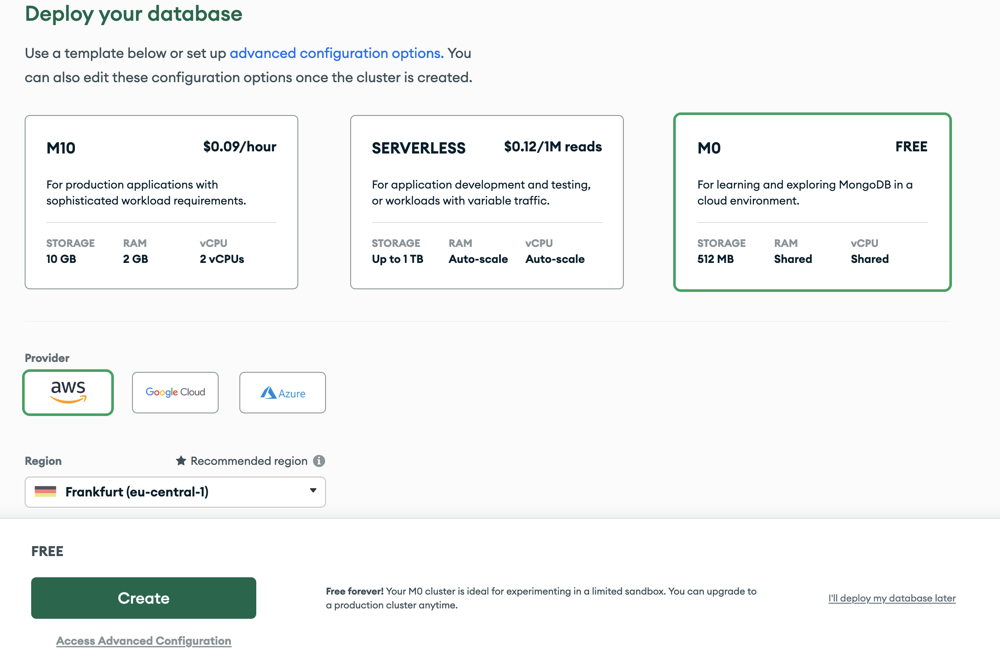
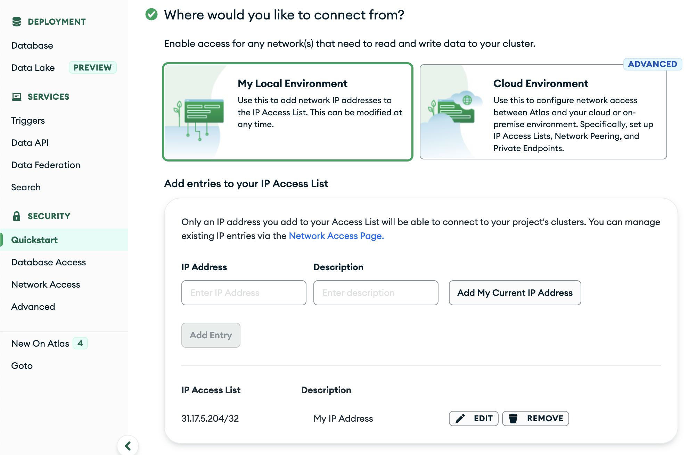
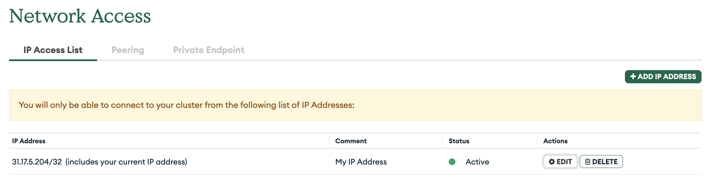
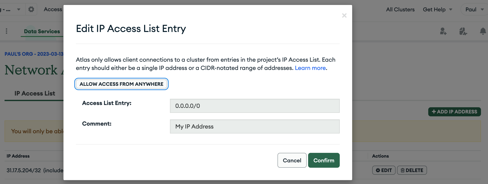
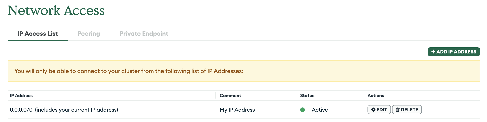
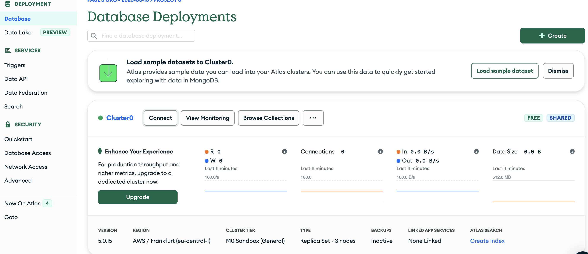
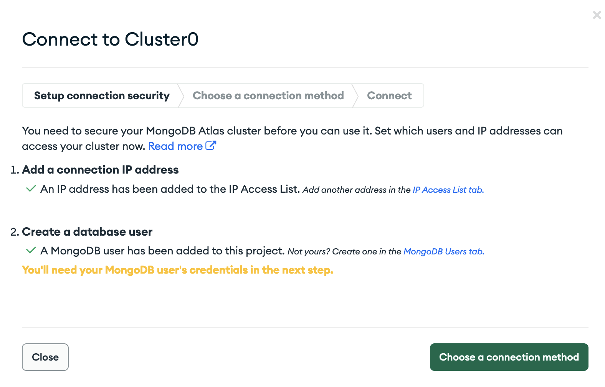
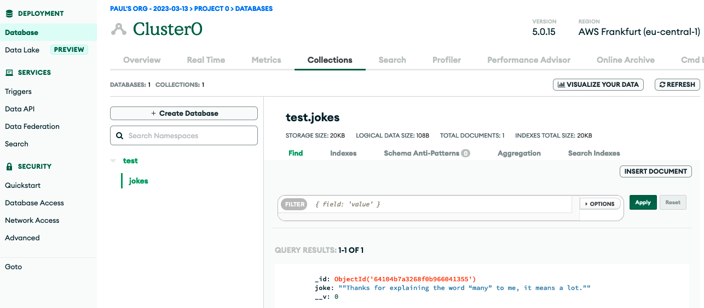

# Backend - Overview

- [ ] [Backend Basics](#backend-basics)
- [ ] [Backend API Routes](#backend-api-routes)
- [ ] [MongoDB](#backend-mongodb)
- [ ] [MongoDB - Atlas install Guide](#backend-mongodb-atlas)
- [ ] [Backend - **C**reate](#backend-create)
- [ ] [Backend - **R**ead](#backend-read)
- [ ] [Backend - **U**pdate](#backend-update-and-delete)
- [ ] [Backend - **D**elete](#delete)

# Backend Basics

## Learning Objectives

- [ ] Knowing that JavaScript can be executed outside of the browser
- [ ] Knowing Node.js is a runtime environment for JavaScript
- [ ] Understanding that the browser und Node.js provide environment specific APIs
- [ ] Knowing the terms server, backend and frontend
- [ ] Having a general understanding of the request - response mechanism

---

## JavaScript outside of the Browser

So far we have only used JavaScript in the browser. But JavaScript can also be used outside of the browser.

Node.js is a runtime environment for JavaScript. It allows us to run JavaScript outside of the browser. Node.js has some differences to the browser. For example, Node.js does not have a DOM. But it provides some APIs that are not available in the browser. For example, Node.js provides an API to access the file system.

One thing that Node.js can do is to create a web server. A web server is a program that listens for requests and sends responses back to the client. The web server can be used to serve web pages or to provide an API for a web application.

## Running a Node Program

To run a Node program you need to use the `node` command. The `node` command takes the path to a JavaScript file as an argument. The following `node` command will execute the JavaScript file `index.js` in the root of the project: `node index.js`.

For convenience, our templates include a script in the package.json that allows you to run the program with **`npm run start`**. The template includes a development mode, that automatically restarts the program when you make changes to the code. To start the development mode you can use **`npm run dev`**. Take a look at the `package.json` file to see how the scripts are defined.

## A Basic Node.js Program

A Node.js program can be almost anything. It can be a web server, a command line tool or a script that does some calculations. Try out to create a Node.js program that prints "Hello World" to the console or does some calculations.

```js
console.log("Hello World");
```

```js
const answer = 32 + 4;
console.log(answer);
```

Run the program with the `node` command. For example, if you save the program in a file called `index.js` you can run the program with `node index.js`.

> 💡 You can use the `console.log` function to print values to the console. In the case of Node.js the console is the terminal and not the browser console.

## Node.js Servers

You can use Node.js to create web servers. To do so you can use the `http` module provided by Node.js.

You can import a native node module by using the `node:` prefix. For example, to import the `http` module you can use the following code:

```js
import { createServer } from "node:http";
```

You don't need to install the `http` module. It is included in Node.js.

### Creating a Server

The `http` module provides a function called `createServer` that takes a callback function as an argument. The callback function is called whenever a request is made to the server. The callback function is called with two arguments: `request` and `response`. The `request` object contains information about the request that was made to the server. The `response` object is used to send a response back to the client.

```js
import { createServer } from "node:http";

export const server = createServer((request, response) => {
  response.statusCode = 200;
  response.end("Hello World");
});
```

The `response.statusCode` property is used to set the status code of the response. The `response.end` method takes a string as an argument. The string is sent back to the client.

You can access the `request` object to get information about the request that was made to the server. For example, you can access the `url` property of the `request` object to get the URL that was requested.

```js
import { createServer } from "node:http";

export const server = createServer((request, response) => {
  if (request.url === "/") {
    response.statusCode = 200;
    response.end("Hello World");
  } else {
    response.statusCode = 404;
    response.end("Not Found");
  }
});
```

> 💡 Online you will find the abbreviations `req` and `res` for `request` and `response`. This is a common convention but `req` and `res` are very hard to distinguish so we will use the full names in this bootcamp.

### Starting the Server (Listening for Requests)

To start the server you need to call the `listen` method on the server object. The `listen` method takes two arguments: the port number and an optional callback function. The callback function is called when the server is ready to accept requests.

To separate the code that creates the server from the code that starts the server you can export the server object from a `server.js` file and start the server in `index.js`:

```js
// index.js
import { server } from "./server.js";

const port = 8000;
server.listen(port, () => {
  console.log(`Server running at http://127.0.0.1:${port}/`);
});
```

> 💡 When you call `listen`, Node.js will keep the program running instead of exiting immediately. This is necessary because the program needs to keep running in order to accept requests.

## Resources

- [Node.js Website](https://nodejs.org/)
- [`http.createServer()` in the Node.js Docs](https://nodejs.org/api/http.html#httpcreateserveroptions-requestlistener)
- [`server.listen()` in the Node.js Docs](https://nodejs.org/api/http.html#serverlisten)

# Backend API Routes

## Learning Objectives

- [ ] knowing what serverless functions are
- [ ] understanding what a server-side API is meant for
- [ ] knowing how to implement Next.js API routes
  - [ ] static API routes
  - [ ] dynamic API routes
- [ ] knowing how to debug API routes with `console.log()`
  - [ ] on your local running server
  - [ ] on a deployed server on Vercel

---

## Serverless functions

There are different approaches to creating backend functions for web applications.

A traditional web server for example built with the Node.js framework Express is a program running on a server or virtual machine that listens for incoming HTTP requests - like a waiter at a restaurant waiting for customers to place their orders. The code for the Express server is typically written in a so called monolithic structure, where all the different functions and endpoints are managed by the same program.

On the other hand Serverless Functions are like little helpers that are only executed on-demand, i.e. when they are needed. They wait for specific things to happen, like when a web applications gets a HTTP request or when a database gets updated. When that happens, the serverless function runs its code to do the specific job it was programmed to do and is terminated afterwards.
Serverless cloud provider, like Vercel, take care of all the details like setting up the computer resources needed to run the code and shutting them down when the job is done. It's like having a team of chefs come into the kitchen, cook a dish, and then clean everything up when they are finished. This makes it easier for developers to write code without having to worry about managing servers or resources.

> 💡 This is a very basic explanation. If you're interested in learning more about
> Vercel Serverless Functions, you can read about it [here](https://vercel.com/docs/concepts/functions/serverless-functions)

---

## What a server-side API is meant for

As we already learned in the JS Fetch session an API (Application Programming Interface) can be seen from different perspectives and occur on various levels.

APIs running on a server environment are called server-side APIs. They are provided by a _server_, opposing to the APIs provided by the browser (which is also called the _client_). A common use-case for such server-side APIs is to create, read, update and delete data; so called CRUD operations.

> 💡 Take a look at handout of the JS Fetch Session to refresh your knowledge of APIs.

Serverless functions are running on a server! But they are running without any additional configuration and they will just run the Code that is in the function defined.

Example serverless function in NextJS (e.g. in file `pages/api/dummy/index.js`)

```js
export default function handler(request, response) {
  response.status(200).json({ status: "dummy api call ok!" });
}
```

Only this function is executed on the server and therefore called serverless. The function itself has no file-system or persistent storage but it could access a database if it wanted to.

## Next.js API routes

Our main goal is to build a database and to handle its data in our web application. To do this we have to create our own API routes inside of the web application and decide what information and data the routes return. Luckyly, Next.js provides us with a cool feature using simple and intuitive syntax.

It follows a simple folder structure: Any file inside the folder e.g. `pages/api/test/file.js` is mapped to the respective url with the same path e.g. `/api/test/file` and will be treated as an API endpoint instead of a page.

In Next.js, an API route is simply a JavaScript module that exports a default function. For example, a file called `pages/api/hello.js` creates the API endpoint `/api/hello` that responds with a JSON message of "Hello neuefische!". The handler function takes two arguments: a request object and a response object, which are used to start the serverless programm on vercel and handle incoming requests and send responses back to the client.

```js
export default function handler(request, response) {
  response.status(200).json({ message: "Hello neuefische!" });
}
```

> 💡 Further information about [Next.js API Routes](https://nextjs.org/docs/api-routes/introduction).

---

### Dynamic API Routes

Next.js supports Dynamic API Routes to create API endpoints that can handle dynamic parameters in the URL path and follows the same file naming rules used for pages.

For example, if you want to create an API endpoint that can handle requests for individual jokes, you could create a file called `/pages/api/jokes/[id].js`. This creates a dynamic API route where the id parameter can be any value. If you want to get a single joke, depending on the jokes `id` used in the browser route, we can acess the `id` route parameter by destructuring it from `request.query` object.

```js
export default function handler(request, response) {
  const { id } = request.query;
  //...
}
```

> 💡 Further information about [Next.js Dynamic API Routes](https://nextjs.org/docs/api-routes/dynamic-api-routes).

### Static routes

Create static route by creating a new file under `pages/api/jokes/index.js`:

```js
const jokes = []; // fill it up or import it from somewhere else

export default function handler(request, response) {
  response.status(200).json(jokes);
}
```

Then you can access your first private API route with `http://localhost:3000/api/jokes` in the browser.

### Dynamic routes

Create dynamic routes by creating a new file with square brackes like: `pages/api/jokes/[id].s`:

```js
const jokes = [{ id: 0, joke: "only bad joke here" }]; // fill it up or import it from somewhere else

export default function handler(request, response) {
  /* the values from query object are always strings and the id from the jokes is a number
   *  -> we need to convert the string to a number with parseInt
   */
  const id = parseInt(request.query.id);
  const joke = jokes.find((j) => j.id === id);
  if (!joke) {
    response.status(404).json({ status: "Joke not found" });
    return;
  }
  response.status(200).json(jokes);
}
```

Then you can access your dynamic private API routes with `http://localhost:3000/api/jokes/0` in the browser.

## Using private API routes in your React application

In React you can use your private API routes by just using the `useSWR` hook like before but passing the relative URL to it instead:

```js
const { data } = useSWR(id ? `/api/jokes/${id}` : null);
```

Note that you **DON'T** need to pass the whole host with `http://localhost:3000` because you are running your frontend and backend application together in NextJS.

## How to deploy NextJS App (including API) to Vercel

1. Sign up at vercel.com with your GitHub account.
2. Then visit https://vercel.com/new where you can choose from a repository from your GitHub profile which should be deployed. Choose one where you have a NextJS application
3. On the next screen leave the default options as they are and click `deploy`
4. Wait up to 5 minutes and then use the link that is provided to you
5. You can now test your whole application including the API routes you have defined

## How to log/debug with `console.log()`

You can use the `console.log()` function to debug your web application and understand what is happening within your API Routes. Since the API handlers are executed on the server, the console output will be displayed in your terminal (localhost) where you started the development server (`npm run dev`) or in the Vercel web interface (vercel deployment).

local: shown in terminal / server console


Vercel: shown in web interface


> 💡 Further information about [Vercel Runtime Logs](https://vercel.com/docs/concepts/observability/runtime-logs)

You can always put console.log() in the handler function (e.g. in `pages/api/jokes/index.js`)
You will see the result then in the running terminal where you started your application with `npm run dev`
Tipp: Install the [Console Ninja](https://marketplace.visualstudio.com/items?itemName=WallabyJs.console-ninja) VSCode extension for better readability of your logs.

### Logging/debugging for deployed running server on Vercel

You can have a look into your dashboard of Vercel for your deployed backend and have a look into the logs.

## Resources

- [Next.js API Routes](https://nextjs.org/docs/api-routes/introduction)
- [Vercel Serverless Functions](https://vercel.com/docs/concepts/functions/serverless-functions)
- [Vercel Runtime Logs](https://vercel.com/docs/concepts/observability/runtime-logs)

# Backend MongoDB

## Learning Objectives

- [ ] Knowing the difference between a database and a server
- [ ] Knowing the difference between relational and non-relational databases
- [ ] Understanding MongoDB basics and important terms
- [ ] Having basic knowledge of database design:
  - [ ] how to structure collections (foreign keys, references)
  - [ ] how to structure documents (nested objects)
  - [ ] one to one (1:1)
  - [ ] one to many (1:n)
  - [ ] many to many (n:m)

---

## Introduction: Databases

### What is a Database?

Let's recall what a server is:

- a program running 24/7 that is designed to **provide services to other computers or devices**,
- it can host a variety of services, such as a web server, an email server, a file server, or **a database server**,
- we have used Next.js API routes as a server to _serve_ data (from a `data.js` file in the same project).

Now consider what a database server is:

- it is a program that is specifically designed to **host and manage a database**,
- it manages the data stored in the database,
- it ensures that it is available to users and applications that need to access it.
- The data storage in a database is persistent.

### Relational vs. non-relational Databases

There are some [differences between relational and non-relational databases](https://www.mongodb.com/compare/relational-vs-non-relational-databases)
(aka SQL vs NoSQL):

**Relational**:

- data is stored in tables (like Excel, Numbers, Spreadsheets, …),
- the tables are connected to each other,
- constraint: we must decide for each column what we do if we don't have data for all entries in this column

**Non-relational**:

- data is stored in JSON-like structures,
- data is stored in key/value pairs,
- each data set in the database can have unique keys

> 💡 You can find an [in-depth explanation and comparison here](https://www.mongodb.com/compare/relational-vs-non-relational-databases).

---

## MongoDB

- As a non-relational database, MongoDB is less strict and easy to use.
- The name MongoDB comes from "hu_mongo_us" \_d_ata_b_ase.
- The name was chosen to reflect the scalability and flexibility of the database.

### MongoDB Terminology

**Database**:

- A MongoDB database is a collection of data that is organized and stored in a specific way, using the MongoDB database management system.
- A MongoDB database can have multiple sets of data called _collections_.

**Collection**:

- A collection is a grouping of MongoDB entries called _documents_.
- A collection is a equivalent of a table in a relational database system.
- A collection exists within a single database.

**Document**:

- A MongoDB document is a _JSON-like data structure that consists of key-value pairs_.
- Documents can have different _fields_.
- These key-value pairs are called _fields_.

**Field**:

- In MongoDB, a field is a _key-value_ pair that is stored in a _document_.
- The field key is a string that identifies the field, and the field value is the data stored in the field.

### MongoDB Queries

You can search your local MongoDB in MongoDB Compass. To do so, open the mongo shell at the bottom of the app.

Common commands:

- `dbs`: show all databases
- `db`: show name of current database
- `use jokes-database`: switch to the database called `jokes-database`

The following commands refer to a collection called `jokes`:
| | Query Methods (one) | Query Methods (many) |
| ---------- | ------------------------------------------------------------------------------------------------------------------------------- | --------------------------------- |
| **C**reate | `db.jokes.insertOne({joke: "What's the action like at a circus? In-tents."})` | `db.jokes.insertMany([{…}, {…}])` |
| **R**ead | `db.jokes.findOne({_id: ObjectId("[paste_id_here]")})` | `db.jokes.find(…)` |
| **U**pdate | `db.jokes.updateOne({ _id: ObjectId("[paste_id_here]") }, { $set: { joke: "What's the action like at a circus? In-tents." } })` | `db.jokes.updateMany(…)` |
| **D**elete | `db.jokes.deleteOne({_id: ObjectId("[paste_id_here]")})` | `db.jokes.deleteMany(…)` |

> 📙 See the [MongoDB documentation](https://www.mongodb.com/docs/mongodb-shell/crud/) for details how to use the query methods.

---

## Database Design

General Guidance:

- Design your collections and documents around the data you need to store and the queries you need to perform.
- Use arrays to store lists of related data within a single document.
- Try to avoid deeply nested data structures. If your documents become too complex start to split the data into multiple collections and connect the data with references (see the example below).
- If you want to reference an object that is stored in a different collection, you can use foreign keys:
  - If you have a **users** collection and a **jokes** collection, you can use a foreign key in the **jokes** collection to store a reference to the user who created each joke.
  - This allows you to store information about the user who created each joke, without duplicating data in the jokes collection.

### Database Relationships

There are three different relationships between documents:

**One-To-One**

- A one-to-one relationship in MongoDB exists when one document in one collection is related to exactly one document in another collection.
- This can be implemented by storing a reference to the related document in any of the two collections. The direction does not matter in this case. One-to-one relationships only make sense in certain special cases. For simplicity sake, think about adding the fields of one collection into the other instead.

**One-To-Many**

- A one-to-many relationship in MongoDB exists when a document in one collection is related to multiple documents in another collection.
- This can be implemented by storing a reference to the "one" collection document in the connected "many" collection documents.

**Many-To-Many**

- A many-to-many relationship in MongoDB exists when multiple documents in one collection is related to multiple documents in another collection, and vice versa.
- This is usually achieved by creating an intermediary collection which documents have a reference to both connected collections (i.e. they are split into two one-to-many relationships).

> 📙 Read more about these [relationships in the MongoDB documentation](https://www.mongodb.com/docs/manual/tutorial/model-embedded-one-to-one-relationships-between-documents/).

### Example Visualization

The following three collections visualize the best practices and relationships mentioned above.


```json5
// Jokes collection:
{
  "_id": ObjectId("joke1ID"),
  "userId": ObjectId("user1ID"),
  "joke": "Why do programmers hate nature? It has too many bugs.",
}

// Users collection:
{
  "_id": ObjectId("user1ID"),
  "username": "jane.doe",
  "email": "jane.doe@example.com",
}

// Comments collection:
{
  "_id": ObjectId("comment1ID"),
  "jokeId": ObjectId("joke1ID"),
  "userId": ObjectId("user1ID"),
  "comment": "That's a good one!"
}
```

Notes:

- Each document in the collections has an `_id` field that is a unique identifier.
- Each joke document has a `joke` field that stores the text of the joke and a `userId` field that stores the ID of the user who created the joke. This establishes a **one-to-many** relationship between the joke and the user collection (one joke is owned by one user, but one user can own many jokes).

- Each user document has a `username` field that stores the user's username and an `email` field that stores the user's email address.

- Each comment document has a `jokeId` field that stores the ID of the joke that the comment is associated with, a `userId` field that stores the ID of the user who created the comment, and a `comment` field that stores the text of the comment.
- The `jokeId` field and `userId` field implement **one-to-many** relationships between the comments, jokes, and users collections, as a joke can have multiple comments and a user can create multiple comments, but each comment can only be associated with one joke and one user.

---

## Resources

- [Differences between relational and non-relational databases](https://www.mongodb.com/compare/relational-vs-non-relational-databases)
- [In-depth explanation and comparison relational/non-relational](https://www.mongodb.com/compare/relational-vs-non-relational-databases)
- [CRUD operations in MongoDB documentation](https://www.mongodb.com/docs/mongodb-shell/crud/)

# Backend MongoDB Atlas

## Learning Objectives

- [ ] Knowing what MongoDB Atlas is
  - [ ] Creating an account for Mongodb Atlas
  - [ ] Creating a cluster and database
  - [ ] Setting up database user and security settings
  - [ ] Connecting with local app
- [ ] Setting up vercel with MongoDB Atlas

---

## MongoDB Atlas Introduction

For now, we have only worked with a local database hosted on our computer. However, when we host an application e.g. on Vercel, we cannot use our local database for such external projects.

In order to access our database, we need to make it accessible from the internet. This is why we depend on external providers to host our database. We will use MongoDB Atlas, a cloud provider for mongo databases.

---

## Setting up a MongoDB Atlas account and database

Follow this guide to set up your MongoDB Atlas account and your first database.

1. Go to [the MongoDB Atlas homepage](https://www.mongodb.com/atlas/database) and choose "Try Free" to start the process.
2. Create an account by providing your data or sign up using Google.
3. You might need to verify your MongoDB email adress.
4. You might be asked to tell MongoDB Atlas something about your future usecases:


5. To create a cluster, choose
   1. `M0 Free`,
   2. `aws`, and
   3. `Frankfurt` and click on "Create".



6. In the left-hand navigation, choose `Security > Quickstart` to generate a first user.
   1. Choose a username and a password.
   2. 🚨 Make sure to write down your password!
   3. Click on "Create User".


7. Scroll down to choose where you would like to connect from:
   1. Choose "My Local Environment".
   2. Click "Add My Current IP Adress".



8. In the left-hand navigation, choose `Security > Network Acess`.



10. In the IP Access List, behind your IP Adress, click on "Edit".
11. In the pop-up window, click "Allow Access from Anywhere".



12. Your Network Access tab should now look like this:



13. In the left-hand navigation, choose `Deployment > Database` which brings to this view:



14. On the right side of your cluster's name (here "Cluster0"), click the "Connect" button.
15. In the pop-up window, click "Connect your application":


16. Create a database user with a username and a password:


17. You should now see this screen:



18. Click on "Choose a connection method". You will see a screen similar to the following:


19. Copy the MongoDB URI (in this case, `mongodb+srv://paul:<password>@cluster0.mu12zrz.mongodb.net/?retryWrites=true&w=majority`). You will need it in your application.
20. Note the hint below: `Replace <password> with the password for the paul user.`
    1.  This is the user you have just created one step back (NOT the admin from the beginning).

## Connect your application with MongoDB Atlas

Creating a connection between your application and the cloud database in MongoDB Atlas is now very easy.

> 💡 We assume your app already has a local database connected.

1. In the root of your project, create a new file `.env`.
2. In the `.env` file, insert a variable called `MONGODB_URI` and declare it with the MongoDB Atlas URI you have created when setting up your connection above.
   1. The `.env` should look like this: `MONGODB_URI=mongodb+srv://paul:<password>@cluster0.mu12zrz.mongodb.net/?retryWrites=true&w=majority`.
   2. Replace the `<password>` part with the password for your database user (in this case, the user is called "paul").
   3. Note that you have to remove the brackets `<>` around the password as well.
3. Add `.env` to the `.gitignore` file if not already included. You can now delete your `.env.local` file.

4. Restart the development server and check your browser: you can now read, create, update and delete entries from your cloud database hosted by MongoDB Atlas! 🎉
5. You can check the collections and documents of your database via `Deployment > Database > Collections`:



---

## Vercel and MongoDB Atlas (environment variables)

When deploying an application to Vercel, the app is not able to connect with your cloud database. This is because the authentication information (user and password) is stored in a `.env` file which is only available to your local development environment.

This is why we need to provide Vercel with the access details.

1. In the dashboard of your Vercel project, navigate to "Settings":


2. In the left-hand navigation, choose "Environment Variables".
   1. Add the key (`MONGODB_URI`) and the value (`mongodb+srv...`)
   2. Tick all environments (Production, Preview, and Development).
   3. Click "Save".


3. At the bottom of this page, you should now see a new environment variable:


4. Redelpoy your application:
   1. In the main navigation, choose "Deployments".
   2. Open the three dots next to your last deployment and choose "Redeploy".


5. If there's a popup, hit the "Redeploy" button again.


6. Congratulations, you are done! Open the Vercel URL of your project to see that your deployed application has now access to the cloud database.

> 📙 Read more about [how to set up environment variables in the Vercel docs](https://vercel.com/docs/concepts/projects/environment-variables).

## Resources

- [MongoDB Atlas Tutorial](https://www.mongodb.com/basics/mongodb-atlas-tutorial)
- [Environment Variables (Vercel Docs)](https://vercel.com/docs/concepts/projects/environment-variables)

# Backend Create

## Learning Objectives

- [ ] Understanding CRUD and REST APIs
- [ ] Building a Create REST API route

---

## CRUD and REST

### CRUD

The acronym CRUD [kɹʌd] covers the four basic operations of persistent storage

- **Create**, _create a record_,
- **Read** or **Retrieve**, _read a record_,
- **Update**, _update a record_, and
- **Delete** or **Destroy**, _delete a record_.

These operations can be expressed using different terms depending on context or environment.

| CRUD                      | MongoDB                    | SQL      | HTTP Method | typical Rest URL (with HTTP Method)     |
| ------------------------- | -------------------------- | -------- | ----------- | --------------------------------------- |
| **Create**                | `insertOne` / `insertMany` | `INSERT` | POST        | `/todos`                                |
| **Read** or **Retrieve**  | `findOne` / `find`         | `SELECT` | GET         | `/todos/[todoId]` (one), `/todos` (all) |
| **Update**                | `updateOne` / `updateMany` | `UPDATE` | PUT / PATCH | `/todos/[todoId] `                      |
| **Delete** or **Destroy** | `deleteOne` / `deleteMany` | `DELETE` | DELETE      | `/todos/[todoId]`                       |

> 💡 Note that the **Create** operation refers to the HTTP method `POST`. You'll need the corresponding HTTP method whenever you want to perform one of the **CRUD** operations.

### REST

REST is short for "Representational State Transfer" and refers to architectural principles and constraints how to structure your API.

We use CRUD operations and HTTP methods with a REST API.

> 💡 This is a very basic and incomplete explanation. If you're interested in learning more about
> what makes an API RESTful, you can read about it [here](https://restfulapi.net/).

---

## Create with Mongoose

To create a new entry in your database, you need to define a `POST` API route:

```js
// pages/api/index.js
if (request.method === "POST") {
  try {
    const jokeData = request.body;
    // We're declaring jokeData to contain the body of our request sent by our form that we haven't created yet.
    // The body of our request might contain data in a variety of formats, but is typically an object.
    const joke = new Joke(jokeData);
    // Utilizing our Joke scheme, we're creating a new joke.
    // At this point we're sanitizing our data according to the schema of our Joke model.
    await joke.save();
    // We've created a new joke, now we're calling save() to have mongoose insert a new document into our database.

    // The three lines above are functionally the same as:
    // Joke.create(request.body)
    // It's just a somewhat less opaque way.

    response.status(201).json({ status: "Joke created" });
  } catch (error) {
    console.log(error);
    response.status(400).json({ error: error.message });
  }
}
```

Note that the `POST` route alone does not create a new entry in your database: you need to tell your form's submit handler to use this route.

> 📙 Read more in the [mongoose docs](https://mongoosejs.com/docs/models.html#constructing-documents), but don't get confused: they suggest `.create` and `.insertMany()`.

---

## `POST` using `fetch`

To connect the form submit handler with your `POST` API route, you need to call `fetch()` with two arguments: the `POST API route` and an `options` object.

In this object, you set the HTTP method to `POST` (instead of the default `GET`) and specify the value for the `body` key (= the data you want to send).

> 💡 The `body` key represent the `request.body` in the API route above: this is where the actual data is passed from frontend to the API (and then to the backend aka database).

```js
import useSWR from "swr";

export default function JokeForm() {
  const jokes = useSWR("/api/jokes");
  // We're declaring jokes here because we call the .mutate() method below.

  async function handleSubmit(event) {
    event.preventDefault();

    const formData = new FormData(event.target);
    const jokeData = Object.fromEntries(formData);
    // We're declaring jokeData and filling it with the values we've extracted from our form via Object.fromEntries().

    const response = await fetch("/api/jokes", {
      method: "POST",
      body: JSON.stringify(jokeData),
      headers: {
        "Content-Type": "application/json",
      },
    });
    // Here we're using the API route we've built earlier.
    // We're declaring a response returning a promise while we're posting to our database.

    // Here we're using fetch and not swr, because swr is for data fetching, and not data mutation.
    // ... but we can notify swr about data changes using the mutate function! (See below.)

    // Our method is post, the body contains our jokeData JSON, and our header provides additional information about the data we're sending.

    // Our joke is on its way!

    if (response.ok) {
      // If our attempt at posting our joke is a success, we proceed here.
      await response.json();
      // At this point, the promise of response has resolved.
      jokes.mutate();
      // Now we're notifying swr that our data has been mutated, which will trigger a rerender.
      // If we don't include this line, the page won't automatically refresh and our submitted joke won't be immediately visible.
      event.target.reset();
    } else {
      console.error(`Error: ${response.status}`);
    }
  }
}
```

---

## Revalidation with `swr`'s `mutate()` function

In the example above, you've already seen how to use `jokes.mutate()`.

This is why we use it:

- it marks the data as expired and triggers a refetch (in the above example, `api/jokes` is fetched again)
- `swr` updates the cache automatically (i.e. faster page reloads and the correct data is displayed)

> 📙 [Read more in the documentation](https://swr.vercel.app/docs/mutation#revalidation).

---

## Resources

- [What is REST?](https://restfulapi.net/)

# Backend Read

## Learning Objectives

- [ ] Knowing about ORM and (`mongoose` as) ODM
- [ ] Understanding how to write a `mongoose` Schema
- [ ] Knowing how to connect an application with a (local) database using `mongoose`
- [ ] Knowing how to read data with a `mongoose` model

---

## What and why mongoose

In order to access a MongoDB from your app, we'll need a JavaScript API. This API is sometimes called a database driver (imagine it like your printer drive).

We will use a library called `mongoose`. That's an ODM (Object Document Mapper).

### Difference between ORM and ODM

ORM (_Object Relation Mapping_):

- technique to perform CRUD operations to mainly relational databases (MySQL, PostgreSQL, etc.),
- uses an _object-oriented paradigm_
- like excel spreadsheet with rows and columns => you cannot add a field to one entry that doesn't exist for all
- is mapped to a single object for all entries.

ODM (_Object Document Mapping_):

- like ORM for non-relational databases (MongoDB)
- uses a _document-oriented paradigm_

### Reasons to use `mongoose` as ORM

- It helps building a **schema** and querying the database (it's also our db driver).
- It has to run on the server, because database access is not secure in the browser.
  - Remember: We already have a server (= Next.js API routes).

---

## DB Connect

In order to read data from a database and consume it in our app, we need two things:

- a (local) database with documents (e.g. about jokes)
- a connection between this database and the Next.js app with `mongoose`.

To create the connection, follow these steps:

1. install `mongoose` with `npm install mongoose`
2. create a `.env.local` file at the root of your project with the following content:
   `MONGODB_URI=mongodb://localhost:27017/jokes-database`
   - Files called `.env` contain environment variables: secrets like usernames and passwords **you don't want to share with anybody**.
   - These files should be ignored by git inside of the `.gitignore` file.
   - Note the structure of the content: the variable is called `MONGODB_URI` and has the value `mongodb://localhost:27017/jokes-database`.
   - `jokes-database` is the name of your database: this value can vary.
3. create a `db/connect.js` file and copy the
   [content from the Next.js mongoose example](https://github.com/vercel/next.js/blob/canary/examples/with-mongodb-mongoose/lib/dbConnect.js)
   - Note that this file uses the `MONGODB_URI` we have just set up in `.env.local` to create a connection.

---

## Schema and Models

We need to declare a
[Schema that describes the data type of the documents in a collection](https://mongoosejs.com/docs/guide.html).

We use this Schema to create a Model that we can use to interact with the database.

Note the difference between _Schema_ and _Model_

- the _Schema_ describes the structure of a document
- the _model_ gives us a programming interface for interacting with the database (liking searching the database, updating, etc.)

### Writing a Schema

We write a Schema in the corresponding file placed in the `db/models` folder like this:

- When creating a `new Schema`, we pass an object with the key-value-pairs we want our documents to have, like `joke` which is a `String` and `required`.
- We don't need to define the `id` because `mongoose` will automatically create one.
- Export the Schema to make it available in our application.

```js
// db/models/Joke.js
import mongoose from "mongoose";

const { Schema } = mongoose;

const jokeSchema = new Schema({
  joke: { type: String, required: true },
});

const Joke = mongoose.models.Joke || mongoose.model("Joke", jokeSchema);

export default Joke;
```

Further notes:

- The name of the collection the model works upon is being generated from the models name, in this case "Joke" => "jokes".
- You can call the `mongoose.model` method with a third argument that holds the collection name.
- We have to check whether the model with the name "Joke" has already been compiled and if yes, take the already compiled model. That's why we use the logical OR (`||`) operator.

---

## Using the Model: Querying the DB (.find, .findById)

In our Next.js API route, we can now write a request handler which

- connects to the database with `dbConnect()`,
- uses the Model to search a document, and
- returns the data.

```js
// api/jokes/index.js
import dbConnect from "../../../db/connect";
import Joke from "../../../db/models/Joke";

export default async function handler(request, response) {
  await dbConnect();

  if (request.method === "GET") {
    const jokes = await Joke.find();
    return response.status(200).json(jokes);
  } else {
    return response.status(405).json({ message: "Method not allowed" });
  }
}
```

`mongoose` comes with a `.findById()` method you can use in a dynamic route:

```js
// api/jokes/[id].js
import dbConnect from "../../../db/connect";
import Joke from "../../../db/models/Joke";

export default async function handler(request, response) {
  await dbConnect();
  const { id } = request.query;

  if (request.method === "GET") {
    const joke = await Joke.findById(id);

    if (!joke) {
      return response.status(404).json({ status: "Not Found" });
    }

    response.status(200).json(joke);
  }
}
```

Note that MongoDB returns an `_id` instead of `id`, so you might need to adapt your frontend to get the correct information.

> 📙 You can find a reference to [all methods of a Model in the mongoose documentation](https://mongoosejs.com/docs/api/model.html).

---

## Gathering linked collections with `.populate()`

Imagine your MongoDB has two collections: `jokes` and `comments` on these jokes. They are linked by the `commentIds`.

When reading the `jokes`, you want to get the comments as well. You can easily achieve this by linking both schemas and when you query the database, you simply add `.populate()` with method chaining.
First, link the schemas for `Joke` and `Comment`:

```js
// link the schemas
const jokeSchema = new Schema({
  joke: { type: String, required: true },
  comments: { type: [Schema.Types.ObjectId], ref: "Comment" },
});

const commentSchema = new Schema({
  _id: Schema.Types.ObjectId,
  comment: { type: String, required: true },
  author: { type: String, required: true },
});

const Joke = mongoose.models.Joke || mongoose.model("Joke", jokeSchema);
const Comment =
  mongoose.models.Comment || mongoose.model("Comment", commentSchema);
```

Second, when reading from the database, populate the comments:

```js
const joke = await Joke.findById(id).populate("comments");
```

> 📙 Read more about [populate in the mongoose docs](https://mongoosejs.com/docs/populate.html).

---

## Resources

- [ORM vs. ODM](https://medium.com/spidernitt/orm-and-odm-a-brief-introduction-369046ec57eb)

# Backend Update and Delete

## Learning Objectives

- [ ] Understanding the Update and Delete part of CRUD operations
- [ ] Being able to implement `UPDATE` and `DELETE` API routes

---

## Update

To update an entry in your database, you need to do two things:

- define a `PUT` API route and
- connect the submit handler of an edit form to this API route.

### Update with Mongoose

First, define a `PUT` API route:

```js
// /api/jokes/[id].js
if (request.method === "PUT") {
  const jokeToUpdate = await Joke.findByIdAndUpdate(id, {
    $set: request.body,
  });
  // Find the joke by its ID and update the content that is part of the request body!
  response.status(200).json(jokeToUpdate);
  // If successful, you'll receive an OK status code.
}
```

### `PUT` using `fetch`

Second, tell the submit handler of your edit form

- to use the `PUT` API route (i.e. send a request to your database to edit an entry),
- wait for the database to respond and update the UI if necessary or
- navigate the user to a different page via `push()`.

> 💡 Note: `PUT` and `PATCH` are semantically different. According to convention, we would use `PUT` to update our entire document, and `PATCH` to update individual fields. In our demo, we're using `PUT`, simply because we only ever have _one_ field to update.

You can [use the `useSWRMutation` hook](https://swr.vercel.app/docs/mutation#useswrmutation) to achieve this.

Go to the `page` or `component` where you want to write the submit handler of your edit form.

Import `useSWRMutation` and destructure the `trigger` method and the `isMutating` state:

```js
// pages/[id].js
import useSWRMutation from "swr/mutation";

export default function JokeDetailsPage() {
  //...
  const { trigger, isMutating } = useSWRMutation(
    `/api/jokes/${id}`,
    sendRequest
  );
  // return (...)
}
```

The second argument passed to `useSWRMutation`, the `sendRequest`, is a function you need to write. It is a wrapper function for `fetch` and will be called whenever you call `trigger()`.

Note that it is here where you define the `PUT` method and the `body` for your API route:

```js
// pages/[id].js

async function sendRequest(url, { arg }) {
  // The sendRequest function expects url and { arg } as parameters.
  // This naming convention isn't unintentional. It needs to be named like that.
  // This has to do with how useSWRMutation works.
  const response = await fetch(url, {
    method: "PUT",
    body: JSON.stringify(arg),
    headers: {
      "Content-Type": "application/json",
    },
  });
  // This syntax follows that of any regular HTTP response.
  // Note the arg object that is passed as part of the response body.
  if (response.ok) {
    await response.json();
  } else {
    console.error(`Error: ${response.status}`);
  }
}
```

You now need to write a function that provides your `sendRequest` function with the `arg` object:

```js
// pages/[id].js

async function handleEditJoke(event) {
  event.preventDefault();
  const formData = new FormData(event.target);
  const jokeData = Object.fromEntries(formData);
  // Here you are preparing your updated data to be handed over to your sendRequest function.
  await trigger(jokeData);
  // By calling trigger with our jokeData object, you provide your `sendRequest` function with the necessary `arg` object.
  push("/");
}
```

If you want to redirect to the homepage with `push("/")`, you need to destructure the `push` method from the `useRouter` hook at the top of your component:

```js
// pages/[id].js
export default function JokeDetailsPage() {
  const router = useRouter();
  const {
    query: { id },
    push,
  } = router;
}
```

Summary:

- `trigger` informs `useSWRMutation` about `jokeData`,
- then `isMutating` evaluates to `true` and
- `useSWRMutation` hands over `jokeData` to `sendRequest`
- which accepts it as the `{ arg }` object
- and then sends this `{ arg }` object down your API route as part of your response body.
- Now, `isMutating` evaluates to `false`.
- Once all of this has happened, you're safe to push to your overview page (or any other page).

### Render while `isMutating`

If you want to inform the user that the changes are currently being submitted, you can make use of `isMutating`. Simply add an early return to your component:

```js
// pages/[id].js
if (isMutating) {
  return <h1>Submitting your changes...</h1>;
}
```

> 📙 [Read more about `useSWRMutation` in the swr docs](https://swr.vercel.app/docs/mutation#useswrmutation).

---

## Delete

To delete an entry in your database, you need to do two things:

- define a `DELETE` API route and
- connect a handler function which uses this API route.

### Delete with Mongoose

First, define a `DELETE` API route:

```js
if (request.method === "DELETE") {
  const jokeToDelete = await Joke.findByIdAndDelete(id);
  // Declare jokeToDelete to be the joke identified by its id and delete it.
  // This line handles the entire deletion process.
  response.status(200).json(jokeToDelete);
}
```

### `DELETE` using `fetch`

Second, write a handler function which calls `fetch()` with the appropriate arguments and pass it to a delete button:

```jsx
async function handleDeleteJoke() {
  await fetch(`/api/jokes/${id}`, {
    method: "DELETE",
  });
  // You are handing over the joke identified by its id to our DELETE request method.
  // This is the entire code required to do so.
  push("/");
  // After deleting the joke, you route back to our index page.
}

return (
  <button type="button" onClick={() => handleDeleteJoke()}>
    Delete
  </button>
);
```

---

## Resources

- [useSWRMutation (SWR Docs)](https://swr.vercel.app/docs/mutation#useswrmutation)
