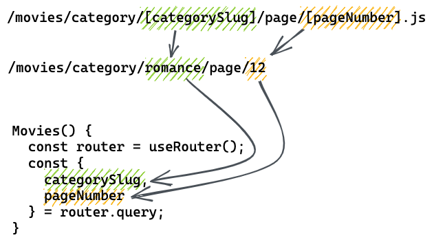

# React - the overview

- [ ] [React Basics](#react-basics)
- [ ] [React Nesting](#react-nesting)
- [ ] [React with Arrays](#react-with-arrays)
- [ ] [React Props](#react-props)
- [ ] [React State](#react-state)
- [ ] [React State 2](#react-state-2)
- [ ] [React State 3](#react-state-3)
- [ ] [React with Local Storage](#react-with-local-storage)
- [ ] [React Effects and fetch](#react-effects-and-fetch)
- [ ] [React Data Fetching](#react-data-fetching)
- [ ] [React Custom Hooks](#react-custom-hooks)
- [ ] [Next.js Basics and Routing](#nextjs-basics-and-routing)
- [ ] [Next.js Dynamic Routes](#nextjs-dynamic-routes)
- [ ] [React Component Testing](#react-component-testing)
- [ ] [React Styled Components](#react-styled-components)
- [ ] [React Global State](#react-global-state)
- [ ] [React Immutable State](#react-immutable-state)

## React Basics

### Learning Objectives

- [ ] Understanding what React is and why it is used
- [ ] Understanding JSX and differences to HTML
- [ ] Understanding the declarative approach of React
- [ ] Creating React components
- [ ] Understanding rendering with React
- [ ] Knowing about the React ecosystem

### What is React and why do we use it?

React is a JavaScript library with the purpose of making the developer's life easier: you don't need to work directly
with the DOM API (e.g. `createElement`) in most cases. You just write simpler (declarative) code
describing what the user interface should look like and React handles the DOM under the hood.

To write declarative code for React, you use JSX.

### Using JSX

JSX is a syntax extension to JavaScript. JSX is neither a string, nor HTML as we know it. JSX
expressions can be used anywhere a JavaScript expression can be used.

```js
const element = <p>Some Text</p>;
```

We use JSX to create React elements. React elements are an intermediary format that React converts
to DOM elements during the rendering process. This allows us to declaratively describe our user
interface using JSX.

### Creating Elements

Just like in HTML, JSX elements are described using opening and closing tags. The opening tag
contains the tag name or the component type (see [Using Components](#using-components)) and any
attributes. The closing tag contains the same tag name or the same component type as the opening tag does and nothing else. The
children of the element are placed between the opening and closing tag. If the element has no
children, the closing tag can be omitted and the element is self-closing.

```js
// Element with children
//
//              opening tag         children
//              |  attributes       |        closing tag
//              |  |                |        |
const element = <p className="text">Some Text</p>;
//               | |         |                 |
//               | |         attribute value   |
//               | attribute name              |
//               tag name or component type ---+

// Self-closing element
//
//            self closing tag   slash denotes self closing
//            |      attributes  |
//            |      |           |
const input = <input type="text" />;
//             |     |    |
//             |     |    attribute value
//             |     attribute name
//             tag name or component type
```

> 💡 Elements that do not support closing tags in HTML like `<br>` or `<input>` must be self-closing
> in JSX (like `<br />` or `<input type="text" />`).

> 💡 Unlike HTML, which is resilient to missing closing tags, JSX is not. If you forget to close a
> tag, you will get an error.

#### Using Components

To create an element from a [component](#react-components), we can simply refer to it by the
function name in JSX and treat it just like any built-in component:

```js
const element = <MyComponent />;
```

Regarding attributes and children, creating elements from component types works just like with any
(HTML) tag name.

> 💡 JSX makes the distinction between built-in (HTML) tag names and components by looking at the
> first character inside the JSX tag. If it is lowercase it's treated as a built-in tag name, if it is
> uppercase it looks for any defined JavaScript function with that name. That is why it is important
> to use PascalCase for component names.

> 📙 Read more about [**Writing Markup with JSX**
> in the React Docs](https://react.dev/learn/writing-markup-with-jsx).

### Attributes

Attributes for built-in HTML elements use JavaScript-centric names from the DOM API. In most cases
the names are the same as in HTML, but there are some exceptions. For example, the `class` attribute
from HTML is called `className` in JSX.

Passing string values to attributes is done by using double quotes. To pass any JavaScript
expression use curly braces.

```js
const element = <p className="text">Some Text</p>;

const myValue = "This is a string";
const input = <input type="text" value={myValue} minLength={5} />;
```

### Nesting Elements

React elements can be nested the same way we have been nesting our HTML elements.

```js
const element = (
  <div>
    <p>Some Text</p>
    <p>Some more Text</p>
  </div>
);
```

> 💡 Multiline JSX expressions are wrapped in parentheses to make them easier to read. No worries:
> Prettier will take care of that for you.

### Interpolating Expressions

We can use any JavaScript expression inside JSX by wrapping it in curly braces. This is called
interpolation. It is similar to string interpolation in JavaScript template strings.

```js
const name = "Pawtricia";
const element = <p>My cat's name is {name}</p>;
```

```js
const a = 5;
const b = 10;

const element = (
  <p>
    {a} + {b} = {a + b}
  </p>
);
```

> 💡 You can only use expressions inside JSX. Statements like `if` or `for` are not allowed.

> 💡 To learn how to interpolate JavaScript expressions inside JSX attributes, refer to the [Attributes](#attributes) section.

> 📙 Read more about [**JavaScript in JSX with Curly Braces**
> in the React Docs](https://react.dev/learn/javascript-in-jsx-with-curly-braces).

### React Components

React applications are built using components. A component is an independent and reusable piece of the user interface that contains its own structure, logic, and potentially styling.

React components are JavaScript functions that
return React elements. Those elements are then turned into DOM elements by React during the
rendering process.

In order to create a React component, we write a named function (using PascalCase) and have it
return the desired elements using JSX.

```js
function MyButton() {
  return (
    <button type="button" className="default-button">
      I'm a button
    </button>
  );
}
```

This is a very powerful concept, because it allows us to reuse the same component in multiple places
in our application.

> 💡 See [Using Components](#using-components) for more information on how to use components in JSX.

> 💡 There are hardly any limitations to how 'small' a component can be (i.e. a button), or how
> 'big' (i.e. an entire page).

> 📙 Read about [**Your First Component**
> in the React Docs](https://react.dev/learn/your-first-component).
>
> **Note**: _Exporting the component_ and _Nesting and organizing components_ are out of scope for this first session.

### Imperative vs. Declarative Programming

The main difference between imperative and declarative code is that imperative code describes _how_
something should be built, and declarative code describes _what_ needs to be built.

> 💡 Imagine building a stool. Imperative "code" would describe the steps you need to take to build
> the stool. Declarative "code" would describe the stool itself.
>
> Imperative:
>
> - take 4 wooden slats
> - take 1 wooden board
> - take 4 screws
> - take a screwdriver
> - screw the slats under the board perpendicularly
> - position your work so that the board is on top
>
> Declarative:
>
> - a stool with 4 legs and a seat, standing upright

In imperative programming, your code performs a series of actions.

In declarative programming, your code describes a desired outcome.

The way we have used JavaScript during this course so far has been mostly imperative. We have
described what needs to be done to get a certain result.

```js
const p = document.createElement("p");
p.classList.add("introText");
p.textContent = "Hello World!";
rootElement.append(p);
```

Now, React allows us to use JavaScript in a declarative way. We describe to React what we want, and
React figures out how to update the DOM according to our description.

```js
root.render(<p className="introText">Hello World!</p>);
// React could interpret this to do the following:
// const p = document.createElement("p");
// p.classList.add("introText");
// p.textContent = "Hello World!";
// rootElement.append(p);
// …
```

### How React Renders

React needs to know where to render the elements it creates. We select the DOM element we want to
render into by using `document.querySelector()`. We then create a React root object. The root object
has a `render()` method that we can use to render React elements into the DOM.

**HTML**

```html
<div id="root"></div>
```

**JavaScript**

```js
const rootElement = document.querySelector("#root");
const root = ReactDOM.createRoot(rootElement);
root.render(<h1>Hello, world</h1>);
```

You'll probably never have to write this code yourself, because it is already included in all
templates and starters. In the real world it usally looks like this:

```js
const rootElement = document.getElementById("root");
const root = ReactDOM.createRoot();

root.render(
  <React.StrictMode>
    <App />
  </React.StrictMode>
);
```

Here we have an imported `<App />` element that is wrapped in `<React.StrictMode>`.

> 💡 `StrictMode` sets up React to run in strict mode. In strict mode React points out potential
> problems in an application.

### React works smart, not hard

React only updates the DOM elements that have changed compared to the last render. This is very
efficient and provides a great user experience (focus stays consistent, inputs keep their values,
etc.) as well as a great developer experience (declaritive code is much easier to reason about).

### Nice to know: React, JSX, Transpilers and Bundlers

Since JSX is not a standard JavaScript syntax, we need to use a [transpiler](https://babeljs.io/) (a tool that translates one variant of a language into another) to transform it into standard JavaScript, that can be understood by the browser.

A [bundler](https://webpack.js.org/) is a tool that combines all the files of our codebase into one file, that we can include in our HTML. The bundler also takes care of running the transpiler when needed.

The bundler creates a development server when we run `npm run start` locally.

> 💡 You might notice that in the challenges we are using an `import` statement to import `.css` files into our JavaScript files. This is not a standard JavaScript feature, but it is supported by the bundler. A css import statement is transformed into a `<link>` element in the HTML automatically.
>
> ```js
> import "./styles.css";
> ```

---

### Resources

- [What is React: A Visual Introduction For Beginners on learnreact.design](https://learnreact.design/posts/what-is-react)
- [Writing Markup with JSX in the React Docs](https://react.dev/learn/writing-markup-with-jsx)
- [JavaScript in JSX with Curly Braces in the React Docs](https://react.dev/learn/javascript-in-jsx-with-curly-braces)
- [Your First Component in the React Docs](https://react.dev/learn/your-first-component)
- [Difference between a Framework and a Library on freecodecamp](https://www.freecodecamp.org/news/the-difference-between-a-framework-and-a-library-bd133054023f/)

## React Nesting

### Learning Objectives

- Understanding the concept of nesting
- Creating multiple custom components to create a hierarchy
- Using the `children` prop to render JSX from the parent component
- Understanding composition as a way to build complex components

---

### Passing JSX as Props

Elements created by JSX are just objects. They can be passed around like any other object: for example, as props.

```js
function UserCard({ avatar }) {
  return <div className="card">{avatar}</div>;
}
```

```js
function App() {
  return <UserCard avatar={<Avatar />} />;
}
```

### The `children` Prop

You are already familiar with nesting built-in browser tags:

```js
<div>
  
</div>
```

Oftentimes you'd want your own components to be nestable as well.

```js
<UserCard>
  <Avatar />
</UserCard>
```

If you nest a component inside of another component, the nested component is passed as a prop to the parent component. This special prop is called `children`.

```jsx
function UserCard({ children }) {
  return <div className="card">{children}</div>;
}
```

This component will render the nested element(s) as a child of the `div` element.

> 💡 The nested element(s) can be a single element, multiple elements, or even a string or number.

> 📙 Read more about [**Passing JSX as children**
> in the React Docs](https://react.dev/learn/passing-props-to-a-component#passing-jsx-as-children).

### Fragments

Sometimes you want to return multiple elements from a component function without wrapping them in a `div` or other element. You can use a `Fragment` (`<></>` or `<Fragment></Fragment>`) for this.

This is necessary because React components can only return a single element from a component function.

```jsx
function UserList() {
  return (
    <>
      <UserCard>
        <Avatar />
      </UserCard>
      <UserCard>
        <Avatar />
      </UserCard>
    </>
  );
}
```

This is equivalent to the following, but the shorthand version above is generally preferred.

```jsx
import { Fragment } from "react";

function UserList() {
  return (
    <Fragment>
      <UserCard>
        <Avatar />
      </UserCard>
      <UserCard>
        <Avatar />
      </UserCard>
    </Fragment>
  );
}
```

> 💡 The `<Fragment></Fragment>` syntax is only necessary if you want to pass the special `key` prop to the fragment, which will become important when you start working with lists.

> 💡 When researching you sometimes might see `<React.Fragment></React.Fragment>`, which is the same thing.

> 📙 Read more about [**Fragment (<>...</>)**
> in the React Docs](https://react.dev/apis/react/Fragment).

---

### Composition

When we build React applications, we often want to build complex components from simpler components. This is called composition.

To do so you need to break down you application into components. You can then compose these components to build more complex components.

It is important to figure out which components you need and how they should be composed. This is called application design.

> 📙 Read [**Thinking in React**
> in the React Docs](https://react.dev/learn/thinking-in-react) up to and including Step 2. Later steps require state, which we will cover in a future session.

---

### Resources

- [Passing JSX as children in the React Docs](https://react.dev/learn/passing-props-to-a-component#passing-jsx-as-children)
- [Fragment (<>...</>) in the React Docs](https://react.dev/apis/react/Fragment)
- [Thinking in React in the React Docs](https://react.dev/learn/thinking-in-react)

## React with Arrays

### Learning Objectives

- [ ] Knowing how to use `.map()` to render lists in JSX
- [ ] Understanding how to render items from an array of objects
- [ ] Knowing to add a unique key for list items

---

### Arrays in JSX

To render elements from an array in React we use the array method `.map()`.

The array method `.map()` is used to apply a transformation to all items of an array. When rendering
an array to JSX we like to do exactly this. We like to transform each item of an array into a JSX
tag. This is why we are using `.map()`.

```js
function Drinks() {
  const drinks = ["water", "lemonade", "coffee", "tee"];

  return (
    <ul>
      {drinks.map((drink) => (
        <li>{drink}</li>
      ))}
    </ul>
  );
}
```

---

### Key Property

The example above misses a tiny, but very important part: the `key` prop!

Without the `key` prop you will see an error in the console:

> `Warning: Each child in a list should have a unique "key" prop.`

When rendering an array in JSX you need to pass a **unique identifier** as value for the `key` prop
of the first JSX tag returned in `.map()`. This is important for React to keep track of changes that
happens to the data when re-rendering.

Therefore you must always make sure your array contains a unique id per item. You can ensure this by
using objects to define the data in your arrays.

```js
function Drinks() {
  const drinks = [
    { id: 0, name: "water" },
    { id: 1, name: "lemonade" },
    { id: 2, name: "coffee" },
    { id: 3, name: "tea" },
  ];

  return (
    <ul>
      {drinks.map(({ id, name }) => (
        <li key={id}>{name}</li>
      ))}
    </ul>
  );
}
```

> 📙 If you are interested in understanding the details behind this, you can read about
> [**the `key` prop** in the React Docs](https://react.dev/learn/rendering-lists#keeping-list-items-in-order-with-key).

> 💡 If you pass the `key` prop to a component, you cannot access it in the component. It is a special prop that React only uses internally.
>
> ```js
> function Drink({ name, key }) {
>   console.log(key); // → undefined
>   return <li>{name}</li>;
> }
>
> function Drinks() {
>   const drinks = [
>     { id: 0, name: "water" },
>     { id: 1, name: "lemonade" },
>     { id: 2, name: "coffee" },
>     { id: 3, name: "tea" },
>   ];
>
>   return (
>     <ul>
>       {drinks.map(({ id, name }) => (
>         <Drink key={id} name={name} />
>       ))}
>     </ul>
>   );
> }
> ```
>
> If you want to access the `id` in this example you can pass it again as a prop:  
> `<Drink key={id} id={id} name={name} />`.

### Keyed Fragments

If you are rendering a list of items that are not wrapped in a single JSX tag, you can use a
`<Fragment>` to wrap the items.

```js
import { Fragment } from "react";

function Drinks() {
  const drinks = [
    { id: 0, name: "water", description: "very wet" },
    { id: 1, name: "lemonade", description: "quite sweet" },
    { id: 2, name: "coffee", description: "cold brew" },
    { id: 3, name: "tea", description: "earl grey, hot" },
  ];

  return (
    <dl>
      {drinks.map(({ id, name, description }) => (
        <Fragment key={id}>
          <dt>{name}</dt>
          <dd>{description}</dd>
        </Fragment>
      ))}
    </dl>
  );
}
```

> 💡 Here you cannot use the short syntax (`<>…</>`) for the `<Fragment>` because you need to
> pass the `key` prop to the `<Fragment>`. The short syntax does not allow to pass props.

---

### Resources

- [React Docs: Rendering Lists](https://react.dev/learn/rendering-lists)

## React Props

### Learning Objectives

- [ ] Understanding what props are
- [ ] Understanding how to pass props to a component
- [ ] Understanding how to use props in a component
- [ ] Understanding how to render conditionally

---

### Using Props

Props is short for properties. They are a way to pass data to a child component. A component receives a props object as the first function parameter.

Props are [passed to a component as attributes](#passing-props-to-a-component).

```js
function UserCard(props) {
  return <div>{props.name}</div>;
}
```

For convenience the props object is often destructured in the function parameter.

```js
function UserCard({ name }) {
  return <div>{name}</div>;
}
```

You can choose any names for your props.

> 💡 There are some naming conventions though. Boolean props are often prefixed with `is`, `has` or `should`. For example `isDisabled`, `hasError` or `shouldShow`. Props that take functions are often prefixed with `on`. For example `onClick`, `onSubmit` or `onHover`. Following these conventions makes it easier to understand the purpose of the prop.

Props can be of any type (string, number, array, object, function, ...).

You should treat the props object as immutable and read-only.

---

### Passing Props to a Component

Props are passed to a component as attributes.

```js
<UserCard name="Alex" />
```

You can pass any type of data as a prop.

```js
<UserCard
  name="Alex"
  age={25}
  onContact={() => console.log("let's chat!")}
  isFavorite={true}
  favoriteFoods={["Pasta", "Salad"]}
  contactDetails={{ email: "alex@spiced.com", phone: "123456789" }}
/>
```

String props can be passed using double quotes. All other props must be passed using curly braces.

> 💡 Notice the double curly braces for the object. This is because the outer curly braces are used to signify a JavaScript expression. The inner curly braces are used to define an object.

> 💡 There is a shorthand syntax for boolean props. If the value should be `true` you can omit the value.
>
> ```js
> <UserCard isFavorite />
> ```

Omitting any attribute will result in the value `undefined` for that prop.

> 📙 Read more about [**Passing props to a Component**
> in the React Docs](https://react.dev/learn/passing-props-to-a-component).

### Conditional Rendering

You can use props to conditionally render parts of a component.

```js
function UserCard({ name, isFavorite }) {
  return (
    <div>
      {name}
      {isFavorite ? <span>🌟</span> : null}
    </div>
  );
}
```

> 💡 In JSX `null` is a way to render nothing.

You can not use an `if` statement within JSX because only expressions are allowed. You can use an `if` statement outside of the JSX though.

```js
function UserCard({ name, isFavorite }) {
  let favoriteStar = null;
  if (isFavorite) {
    favoriteStar = <span>🌟</span>;
  }

  return (
    <div>
      {name}
      {favoriteStar}
    </div>
  );
}
```

> 📙 Read more about [**Conditional Rendering**
> in the React Docs](https://react.dev/learn/conditional-rendering).

---

### Resources

- [Passing props to a Component in the React Docs](https://react.dev/learn/passing-props-to-a-component)
- [Conditional Rendering in the React Docs](https://react.dev/learn/conditional-rendering)

## React State

### Learning Objectives

- [ ] Knowing how to attach events ins React
- [ ] Understanding the concept of "state"
- [ ] Using `useState()` to handle state in React
- [ ] Understanding the React Lifecycle

---

### What is state?

State is data that changes over time. Think of the lamp on you desk. It can be switched on or
switched of. The lamp is in a particular state at a given time and that state can change over time.

Another example could be the amount of money in your purse. At any given time your have a certain amount
of money in your purse, but the amount of money can change. The state of your purse can change.
Going to the grocery store will decrease the amount of money, while going to the ATM will increases
it.

This concepts also applies to software. Your app can have data that changes over time.

Think of a post on a social media app. You might have liked a specific post, or not. The "liked"
state of a post can be on or off, like the lamp on your desk.

The website of your bank refers to your purse in the analog world. At any given time, the banking software
displays the current balance of your account, the current state. You can use the banking software to
change that state. For example you could transfer money to another account to decrease the number
stored in the "balance" state.

Oftentimes such stateful data changes after a user interaction, like a click on a button.

---

### State in React

In React we work with state by using the `useState` hook function.

We call the `useState` function and pass the **initial state** value as argument. This is the value
that is used in our app until something changes.

Calling the `useState` function gives us two things in return:

- a variable with the **current state** as value
- the `set` function to set a **new state**

```js
import { useState } from "react";

function SocialMediaPost() {
  const [liked, setLiked] = useState(false);

  function toggleLiked() {
    setLiked(!liked);
  }

  return (
    <article>
      <p>Liked: {liked ? "Yes" : "No"}</p>
      <button type="button" onClick={toggleLiked}>
        {liked ? "Remove like" : "Add like"}
      </button>
    </article>
  );
}
```

> 💡 There is a naming convention for React apps that the state variable and the function always
> follow the pattern of `x` and `setX`

> 📙 Read more about the
> [**concept of state** in the React Docs](https://react.dev/learn/adding-interactivity).

In React state is encapsulated per instance of a component. Think of a feed in a social media app.
The feed is a list of posts. Each post is an individual instance of the `SocialMediaPost` component,
each with individual state. When you change the "liked" state of one specific post, all other post
stay as the are.

A React component can have multiple states. You can use the `useState` function as much as you need.

You can store all kinds of data in state (like booleans, numbers, strings, objects or arrays).

```js
import { useState } from "react";

function SocialMediaPost() {
  const [liked, setLiked] = useState(false);
  const [comments, setComments] = useState([]);
  const [views, setViews] = useState(0);

  /* ... */

  return <article>{/* ... */}</article>;
}
```

---

### What happens when state changes?

To handle state in React we can not simply use a "normal" variable and assign a new value. React
needs to be informed that the data was changed.

This is related to the render cycle of React components.

When React renders a component it executes the component function, which returns JSX. If the JSX
includes a state variable, it uses the variable's value at that time to place into the JSX. Calling
the `set` function with a new value informs React, that state has changed.

> 💡 Changing a state triggers a re-render of the component.

When re-rendering the component, React executes the component function again from top to bottom,
which will again return JSX. However, this time the variable has a new value - the value that was
passed with the call of the `set` function. This means the return JSX includes the new value.

> 📙 Read more about
> [**state updates and re-rendering** in the React Docs](https://react.dev/learn/render-and-commit).

---

### Resources

- [React Docs: Adding Interactivity](https://react.dev/learn/adding-interactivity)
- [React Docs: Responding to Events](https://react.dev/learn/responding-to-events)
- [React Docs: A simple variable is not enough](https://react.dev/learn/state-a-components-memory#when-a-regular-variable-isnt-enough)
- [React Docs: Render and commit](https://react.dev/learn/render-and-commit)
- [MDN: react events and state](https://developer.mozilla.org/en-US/docs/Learn/Tools_and_testing/Client-side_JavaScript_frameworks/React_interactivity_events_state)

## React State 2

### Learning Objectives

- [ ] Knowing how to handle form fields: controlled components, uncontrolled components
- [ ] Knowing how to handle form submit events
- [ ] Understanding the concept of lifting state up
- [ ] Knowing how to pass state and functions via props
- [ ] Understanding that state updates are not synchronous
- [ ] Knowing what a `hook` in React is and which rules apply to hooks

---

### Sharing State Between Components

### Passing State Down

The value of a state variable and the setter function can be passed down to child components as
props. They are functions and values, so they can be passed down like any other data.

```js
function Parent() {
  const [count, setCount] = useState(0);

  function handleIncrement() {
    setCount(count + 1);
  }

  return <Child count={count} onIncrement={handleIncrement} />;
}
```

```js
function Child({ count, onIncrement }) {
  return (
    <>
      <p>Count: {count}</p>
      <button onClick={onIncrement}>increment</button>
    </>
  );
}
```

### Lifting State Up

When we have multiple components that need to share state, we can lift the state up to the parent
component and pass it down as props. This is called "lifting state up" because you usually start with
the state directly in the child component and then move it up to the parent components as you need
it in more and more components.

A state variable can be passed down to multiple child components. The child components can then
update the state variable by calling the setter function.

Any state variable should live as low in the component tree as possible but has high as needed. If
the whole `App` needs to know about the state variable, it should live in the `App` component. If
only child components of the `Article` need to know about the state variable, it should live in the
`Article` component.

Consider the following example:


Here we find that a `Link` in the `Navigation` component needs to know about a state that previously
existed in the `Article` component. We can lift the state up to the `App` component and pass it down
to the `Article` component as a prop.

> 📙 Read more about
> [**Sharing State Between Components** in the React docs](https://react.dev/learn/sharing-state-between-components).

### Handling Form Data

### Using Form Data `onSubmit`

We can use the `onSubmit` event handler to handle form data. The `onSubmit` event handler is called
when the user submits the form. We can get the form data (just like with regular JavaScript) from
the `event` object.

```js
function SearchForm() {
  function handleSubmit(event) {
    event.preventDefault();
    const form = event.target;
    const searchTerm = form.elements.searchTerm.value;
    console.log("A new search term was submitted:", searchTerm);
  }
  return (
    <form onSubmit={handleSubmit}>
      <label htmlFor="searchTerm">Search</label>
      <input name="searchTerm" id="searchTerm" />
      <button>Search</button>
    </form>
  );
}
```

In this example the input elements value is not manually controlled by React: The input is an
"uncontrolled input". It's value is managed by the browser. In the submit event handler we just
"peek" at the input field and read the value from the DOM.

### Using Controlled Inputs

We can use React to control the value of an input element. This is called a "controlled input". This
means that we manually set the value attribute of the input element. We can wire up a state variable
to the value attribute of the input element. This way the input element will always have the same
value as the state variable. Combined with the `onChange` event handler we can update the state
variable when the user types in the input field.

```js
function SearchForm() {
  const [searchTerm, setSearchTerm] = useState("");

  function handleSubmit() {
    event.preventDefault();
    console.log("A new search term was submitted:", searchTerm);
  }

  return (
    <form onSubmit={handleSubmit}>
      <label htmlFor="searchTerm">Search</label>
      <input
        name="searchTerm"
        id="searchTerm"
        value={searchTerm}
        onChange={(event) => setSearchTerm(event.target.value)}
      />
      <button>Search for {searchTerm}</button>
    </form>
  );
}
```

In this example you always know the value of the search term input. Since it is a state variable,
you can use it in other places in your application. You should prefer using uncontrolled inputs
when possible, but sometimes you need to use a controlled input.

You might need a controlled input when

- showing search results while the user is typing,
- autocompleting the user's input or
- validating the user's input.

### State Updates are not Immediate

When we call the setter function of a state variable, React will not immediately update the state
variable. Instead, it will update it's internal value and schedule a re-render of the component.

```js
// ⚠️ This code is broken!
function Counter() {
  const [count, setCount] = useState(0); // count is 0 initially

  function handleIncrement() {
    // when this is first called, count is still 0
    console.log(count); // → 0

    // this will set reacts internal state to 1,
    // but does not update the count variable
    setCount(count + 1);
    console.log(count); // → 0

    // the count variable is still 0, thus count + 1 is still 1,
    // so react's internal state will still be 1
    setCount(count + 1);
    console.log(count); // → 0

    // since setter functions were called
    // react will schedule a re-render of
    // the component with the new count value of 1
  }

  return (
    <>
      <p>Count: {count}</p>
      <button onClick={handleIncrement}>increment by 2</button>
    </>
  );
}
```

This behavior can be unexpected, but it is important to understand that state variables are not
immediately updated.

There are a few ways to fix the code above. In this example we could call `setCount(count + 2)` and
be done. If for some reason we need to call `setCount` twice, we can use the functional form of the
setter function, which provides the current internal value of the state variable as an argument.

```js
// ⚠️ This code is unnecessary complicated, but it works!
function Counter() {
  const [count, setCount] = useState(0); // count is 0 initially

  function handleIncrement() {
    // when this is first called, count is still 0
    console.log(count); // → 0

    // this will set reacts internal state to 1,
    // but does not update the count variable
    setCount((prevCount) => prevCount + 1);
    console.log(count); // → 0

    // the internal value of count is 1,
    // we get it as the the first parameter of the function we pass to the setter.
    // 1 + 1 is 2, so react's internal state will now be _2_
    setCount((prevCount) => prevCount + 1);
    console.log(count); // → 0

    // since setter functions were called
    // react will schedule a re-render of
    // the component with the new count value of _2_
  }

  return (
    <>
      <p>Count: {count}</p>
      <button onClick={handleIncrement}>increment by 2</button>
    </>
  );
}
```

> 💡 Here the prefix `prev` is used to indicate that the value is the previous value of the state
> variable. Another common convention is to use the just the first letter of the state variable as
> the parameter name: `setCount(c => c + 1)`.

> 📙 Read more about
> [**Updating state based on the previous state**](https://react.dev/apis/react/useState#updating-state-based-on-the-previous-state)
> and
> [**I’ve updated the state, but logging gives me the old value**](https://react.dev/apis/react/useState#ive-updated-the-state-but-logging-gives-me-the-old-value)
> in the React docs.

### React Hooks

The `useState` function is part of a broader set of features of react that give components extra
powers.

Hooks are functions that allow component functions to hook into React features (like state) and
allow components to do more than a traditional JavaScript function can. They follow the naming
convention `useXzy`.

Common hooks that you'll come across are `useState` and `useEffect`.

When using hooks you need to follow a few rules:

- Only call hooks at the top level. Don’t call Hooks inside loops, conditions, or nested functions.
- Only call hooks from React function components or custom hooks. Don’t call Hooks from regular
  JavaScript functions.

> 📙 Read more about [**Hooks** in the React Docs](https://reactjs.org/docs/hooks-overview.html)
> from when they were introduced to React.

---

### Resources

- [Sharing State Between Components in the React Docs](https://react.dev/learn/sharing-state-between-components)
- [Updating state based on the previous state in the React Docs](https://react.dev/apis/react/useState#updating-state-based-on-the-previous-state)
- [I’ve updated the state, but logging gives me the old value in the React Docs](https://react.dev/apis/react/useState#ive-updated-the-state-but-logging-gives-me-the-old-value)
- [Hooks at a Glance in the React Docs](https://reactjs.org/docs/hooks-overview.html)

## React State 3

### Learning Objectives

- [ ] Knowing how to handle arrays and objects in state
- [ ] Knowing what state mutation is and how to avoid it

---

### Avoiding State Mutation

Regardless of how complex the state you have in your application (object, array, array of objects) is, you must always treat state as immutable.
This means that you should not directly mutate the state, e.g. with reassigning a new value to it.

To avoid mutation when updating state, you need to

1. create a new object / array (or make a copy of the existing one), and
2. use the setter function with the recently created / updated copy in order to cause a re-render.

---

### Updating Objects in State

To make a copy of an object and change only some properties, you can use the spread syntax:

```js
const [person, setPerson] = useState({
  firstName: "John",
  lastName: "Doe",
});

function handleChangeFirstName(firstName) {
  setPerson({ ...person, firstName });
}

// Somewhere else:
handleChangeFirstName("Jane");
```

> ❗️ If you were to assign a new value directly, you would mutate the state. This is bad because we must treat state as immutable. Doing so can lead to hard to find bugs.
>
> ```js
> // ⚠️ NEVER DO THIS
> function handleChangeFirstName(firstName) {
>   person.firstName = firstName;
>   setPerson(person);
> }
> ```

> 📙 Learn more about [**Updating Objects in State** in the React Docs](https://react.dev/learn/updating-objects-in-state).

---

### Updating Arrays in State

As you know, there are several ways to update arrays. Some of them, however, mutate the array, and some
of them don't.

|           | avoid (mutates the array)           | prefer (returns a new array) |
| --------- | ----------------------------------- | ---------------------------- |
| adding    | `push`, `unshift`                   | `[...arr]` spread syntax     |
| removing  | `pop`, `shift`, `splice`            | `filter`                     |
| replacing | `splice`, `arr[i] = ...` assignment | `map`                        |
| sorting   | `reverse`, `sort`                   | copy the array first         |

> 💡 It does not matter whether your array state contains only primitives or other objects / arrays;
> in all cases, you should only use the preferred array methods.

### Adding to an Array

To add an element to an array, you can use the spread syntax:

```js
const [numbers, setNumbers] = useState([0, 1, 2]);

function handleAppendNumber(number) {
  setNumbers([...numbers, number]);
}

// Somewhere else:
handleAppendNumber(3);

function handlePrependNumber(number) {
  setNumbers([number, ...numbers]);
}

// Somewhere else:
handlePrependNumber(-1);
```

### Removing from an Array

To remove an element from an array, you can use the `filter` method:

```js
const [numbers, setNumbers] = useState([0, 1, 2]);

function handleRemoveNumber(numberToRemove) {
  setNumbers(numbers.filter((number) => number !== numberToRemove));
}

// Somewhere else:
handleRemoveNumber(1);
```

### Replacing an Array Element

To replace an element in an array, you can use the `map` method:

```js
const [numbers, setNumbers] = useState([0, 1, 2]);

function handleReplaceNumber(oldNumber, newNumber) {
  setNumbers(
    numbers.map((number) => {
      if (number === oldNumber) return newNumber;
      return number;
    })
  );
}

// Somewhere else:
handleReplaceNumber(1, 1337);
```

### Sorting an Array

To sort an array, you can use the spread syntax to make a copy of the array first, then sort the copy:

```js
const [numbers, setNumbers] = useState([12, 2, 42, 4]);

function handleSortNumbers() {
  setNumbers([...numbers].sort());
}
```

> 📙 Learn more about [**Updating arrays without mutation** in the React Docs](https://react.dev/learn/updating-arrays-in-state#updating-arrays-without-mutation).

---

### Updating Arrays of Objects in State

Most of the time, you will encounter arrays of objects in your state.

### Adding a new Object

You can add a new object to the state array by using the spread syntax:

```js
const [trees, setTrees] = useState([
  { id: 0, name: "Oak", height 7.5},
  { id: 1, name: "Beech", height 6},
  { id: 2, name: "Pine", height 10}
]);

function handleAddTree(tree) {
  setTrees([...trees, tree]);
}

// Somewhere else:
handleAddTree({id: 3, name: "Spruce", height: 13})
```

### Removing an Object

To remove an object, you can `filter` the array for a unique identifier. In most cases, this
identifier is in scope because the relevant object is rendered via `map`.

```js
const [trees, setTrees] = useState([
  { id: 0, name: "Oak", height 7.5},
  { id: 1, name: "Beech", height 6},
  { id: 2, name: "Pine", height 10}
]);

function handleRemoveTree(idToRemove) {
  setTrees(trees.filter((tree) => tree.id !== idToRemove));
}

// Somewhere else:
handleRemoveTree(0);
```

### Replacing an Object

To replace an object, you can use `map` to create a new array with the updated object. Remember to create a copy of the object first, otherwise you will mutate the state.

```js
const [trees, setTrees] = useState([
  { id: 0, name: "Oak", height 7.5},
  { id: 1, name: "Beech", height 6},
  { id: 2, name: "Pine", height 10}
]);

function handleSetNewHeightForTree(id, height) {
  setTrees(
    trees.map((tree) => {
      if (tree.id === id) return { ...tree, height };
      return tree;
    })
  );
}

// Somewhere else:
handleSetNewHeightForTree(0, 8);
```

### Sorting an Array of Objects

To sort an array of objects, you can use `sort` on a _copy of the array_ with a custom compare function. The compare function
returns a number, which is used to determine the order of the elements.

```js
const [trees, setTrees] = useState([
  { id: 0, name: "Oak", height 7.5},
  { id: 1, name: "Beech", height 6},
  { id: 2, name: "Pine", height 10}
]);

function handleSortTreesByHeight() {
  setTrees([...trees].sort((a, b) => a.height - b.height));
}
```

> 📙 Learn more about [**Updating objects inside Arrays** in the React Docs](https://react.dev/learn/updating-arrays-in-state#updating-objects-inside-arrays).

### Choosing the State Structure

There are some common pitfalls when choosing your state structure.

### Group Related State

If you have state that belongs (and updates) together, group it into a single object. This makes it easier to update the state.

```js
// ❌ MEH
const [userName, setUserName] = useState("Alex");
const [userAge, setUserAge] = useState(28);

// ✅ BETTER
const [user, setUser] = useState({ name: "Alex", age: 28 });
```

### Avoid Redundant State

If you have a value that is derived from a state, you should avoid storing it in state. Instead just use a normal variable.

The problem with redundant state is that it can get out of sync with the source of truth if you forget to update it correctly.

```js
// ❌ BAD
const [user, setUser] = useState({ name: "Alex", age: 28 });
const [isAdult, setIsAdult] = useState(user.age >= 18);

// ✅ GOOD
const [user, setUser] = useState({ name: "Alex", age: 28 });
const isAdult = user.age >= 18;
```

### Avoid Duplication in State

Avoid storing the same value in multiple places in state. This can lead to bugs and makes it harder to update the state.

```js
// ❌ BAD
const [trees, setTrees] = useState([
  { id: 0, name: "Oak", height 7.5},
  { id: 1, name: "Beech", height 6},
  { id: 2, name: "Pine", height 10}
]);

const [selectedTree, setSelectedTree] = useState(trees.find((tree) => tree.id === 0));

// Somewhere else:
setSelectedTree(trees.find((tree) => tree.id === 2));


// ✅ GOOD
const [trees, setTrees] = useState([
  { id: 0, name: "Oak", height 7.5},
  { id: 1, name: "Beech", height 6},
  { id: 2, name: "Pine", height 10}
]);

const [selectedTreeId, setSelectedTreeId] = useState(0);

const selectedTree = trees.find((tree) => tree.id === selectedTreeId);

// Somewhere else:
setSelectedTreeId(2);
```

### Avoid Having Duplicate Lists in State

If you have a list of items in state, you should avoid storing a derived version of it in a different state variable. This is a common mistake when you want to display a filtered version of the list.

```js
// ❌ BAD
const [trees, setTrees] = useState([
  { id: 0, name: "Oak", height 7.5},
  { id: 1, name: "Beech", height 6},
  { id: 2, name: "Pine", height 10}
]);

const [filteredTrees, setFilteredTrees] = useState(trees.filter((tree) => tree.height > 7));

// Somewhere else:
setFilteredTrees(trees.filter((tree) => tree.height > 9));

// ✅ GOOD
const [trees, setTrees] = useState([
  { id: 0, name: "Oak", height 7.5},
  { id: 1, name: "Beech", height 6},
  { id: 2, name: "Pine", height 10}
]);

const [minHeight, setMinHeight] = useState(7);

const filteredTrees = trees.filter((tree) => tree.height > minHeight);

// Somewhere else:
setMinHeight(9);
```

> 📙 Read more about [**Choosing the State Structure** in the React Docs](https://react.dev/learn/choosing-the-state-structure). The Docs have many more examples and explanations.

---

### Resources

- [Updating Objects in State (React Docs)](https://react.dev/learn/updating-objects-in-state)
- [Updating Arrays in State (React Docs)](https://react.dev/learn/updating-arrays-in-state)

## React with Local Storage

### Learning Objectives

- [ ] Understanding the concept of persistent storage in the browser
- [ ] Knowing the difference between `localStorage` and `sessionStorage`
- [ ] Using the methods `setItem()` and `getItem()`
- [ ] Using a library to handle local storage in React apps

---

### The Web Storage API

> 💡 Note that the Web Storage API is not part of React. It is a browser API that is available in all modern browsers.

The Web Storage API provides two methods for storing data on the client:

- `localStorage` stores data with no expiration date
- `sessionStorage` stores data for one session (data is lost when the browser tab is closed)

Data is stored in the browser and per domain, i.e. all data stored by `example.com` can be accessed by `www.example.com` and `subdomain.example.com`, but not by `others.org`.

This makes it possible to store data across page reloads and browser restarts in a secure way.

To store data the API uses key-value pairs. The key is a string and the value can be a string, a number or a boolean.

> 💡 All following examples use `localStorage` but the same applies to `sessionStorage`.

> 📙 Read more about the [**Web Storage API** on the mdn web docs](https://developer.mozilla.org/en-US/docs/Web/API/Web_Storage_API).

#### Storing Data

To store data, use the `setItem()` method:

```js
localStorage.setItem("name", "Alex");
localStorage.setItem("age", 28);
localStorage.setItem("isOnline", true);
```

#### Retrieving Data

To retrieve data, use the `getItem()` method:

```js
const name = localStorage.getItem("name"); // → "Alex"
const age = localStorage.getItem("age"); // → 28
const isOnline = localStorage.getItem("isOnline"); // → true
```

Calling `getItem` returns `null` if the key does not exist.

```js
const nope = localStorage.getItem("nope"); // → null
```

#### Removing Data

To remove data, use the `removeItem()` method:

```js
localStorage.removeItem("name");
```

#### Clearing All Data

To remove all data, use the `clear()` method:

```js
localStorage.clear();
```

#### Storing Complex Data

The Web Storage API only supports strings, numbers and booleans. To store more complex data, you need to serialize it first. This can be done using the `JSON.stringify()` method:

```js
const user = {
  name: "Alex",
  age: 28,
  isOnline: true,
};

localStorage.setItem("user", JSON.stringify(user));
```

To retrieve the data, you need to parse it using the `JSON.parse()` method:

```js
const user = JSON.parse(localStorage.getItem("user"));
```

#### Helper Functions

To make working with the Web Storage API easier, you can create helper functions that encapsulate the serialization and deserialization:

```js
// store data
function setItem(key, value) {
  localStorage.setItem(key, JSON.stringify(value));
}

// retrieve data
function getItem(key) {
  return JSON.parse(localStorage.getItem(key));
}
```

These functions will work with simple data types like strings and numbers as well as complex data types:

```js
setItem("user", {
  name: "Alex",
  age: 28,
  isOnline: true,
});
setItem("count", 42);

const user = getItem("user");
const count = getItem("count");
```

### React with Local Storage

You can also use the Web Storage API in React. Most commonly, you'll want to persist state in local storage so that it survives page reloads.

React has several ways that allow you to synchronize state with local storage. The general concept is to retrieve the initial state from local storage and to store the state in local storage whenever it changes.

Because it becomes quite tricky to correctly wire up all the different pieces yourself, you'll want to use a library that provides a hook for this.

#### `use-local-storage-state`

The [`use-local-storage-state`](https://github.com/astoilkov/use-local-storage-state) library provides a hook that allows you to persist state in local storage.

You can use it as a drop-in replacement for the `useState` hook (commented out in the example below):

```js
// import { useState } from "react";
import useLocalStorageState from "use-local-storage-state";

function Counter() {
  // const [count, setCount] = useState(0);
  const [count, setCount] = useLocalStorageState("count", { defaultValue: 0 });

  return (
    <div>
      <p>Count: {count}</p>
      <button onClick={() => setCount(count + 1)}>Increment</button>
    </div>
  );
}
```

> 💡 Notice that the first argument of the `useLocalStorageState` hook is the key that is used to store the state in local storage. If you use the same key for multiple components, they will share the same state.

> 💡 You don't need to handle serialization or parsing of complex data yourself with `use-local-storage-state`. The library takes care of it for you in the background.

> 📙 Read more about [**how to use the `use-local-storage-state` hook** in its docs](https://github.com/astoilkov/use-local-storage-state#usage).

---

### Resources

- [Web Storage API on the mdn web docs](https://developer.mozilla.org/en-US/docs/Web/API/Web_Storage_API)
- [use-local-storage-state on GitHub](https://github.com/astoilkov/use-local-storage-state)

## React Effects and Fetch

### Learning Objectives

- [ ] Knowing that `fetch` is a side effect
- [ ] Knowing how to use the `useEffect` hook
- [ ] Understanding the callback function of `useEffect`
- [ ] Understanding the dependency array of `useEffect`
- [ ] Understanding the cleanup function of `useEffect`
- [ ] Knowing other side effects and cases for`useEffect`

---

### Effects in React

Effects are a way to synchronize React components with external systems.

Examples for interactions with external systems include:

- manipulating the DOM directly (e.g. setting the document title)
- making network requests to fetch data
- working with other Web APIs
- setting up and tearing down subscriptions and global event handlers
- setting timers
- integrating with third-party libraries.

Using an effect is an escape hatch from the declarative world of React. It is a way to run imperative code that is not directly related to rendering the UI. While the component function is required to be pure, effect functions by design are not. They encapsulate side effects.

An effect is defined as a function that is executed after the component was rendered (and the DOM was updated). It can be synchronized to run not only on mounting, but when all or only certain reactive values within the component function have changed.

Effect functions can return a cleanup function that is executed before the effect function runs again, or when the component is unmounted.

> 💡 A **reactive value** is a value that changes: props, state, derivatives thereof or values and functions declared inside of a component function.

> 💡 **Mounting** means a component was rendered, put into the DOM and displayed on the screen for first time. After that various updates and re-renders might occur (e.g. due to state changes). **Unmounting** means the component gets removed and is no longer displayed on the screen.

### `useEffect`

The `useEffect` hook is used to add effects to a React component. It takes two arguments:

- a function that defines the effect (usually an anonymous function)
- an array of variables that the effect depends on

For example, the following code will update the component title to the value of the `title` prop:

```js
import { useEffect } from "react";

function Title({ title }) {
  useEffect(() => {
    // updating the document title is a side effect
    // that is not directly related to rendering the UI
    document.title = title;
  });

  return <h1>{title}</h1>;
}
```

### Effect Dependencies

The effect above will run after the component was rendered and the DOM was updated. But that is way more often than necessary. The effect should only run when the `title` prop changes. To achieve this, we can pass an array of reactive values to the `useEffect()` hook. The effect will only run when one of the reactive values in the array changes.

```js
import { useEffect } from "react";

function Title({ title }) {
  useEffect(() => {
    document.title = title;
  }, [title]);

  return <h1>{title}</h1>;
}
```

This becomes important when the component function has more than one prop or state variable. Imagine having a `count` state in the component:

```js
import { useEffect, useState } from "react";

function Title({ title }) {
  const [count, setCount] = useState(0);

  useEffect(() => {
    document.title = title;
  }, [title]);

  return (
    <div>
      <h1>{title}</h1>
      <p>{count}</p>
      <button type="button" onClick={() => setCount(count + 1)}>
        Increment
      </button>
    </div>
  );
}
```

The effect function will only run when the `title` variable is different from the previous value. The `count` state variable is not part of the array, so the effect will not run when the `count` state changes.

> 💡 Always add all reactive values that are used in the effect function to the array of dependencies. React comes with ESLint rules that will warn you if you forget to add a variable to the array of dependencies.
>
> **If the effect has no dependencies the dependency array should be empty: `[]`**.
>
> An empty dependency array tells React to run this effect only once: when the component appears on the screen for the first time.

### Cleanup Function

The effect function can return a cleanup function that is executed before the effect function runs again, or when the component is unmounted.

```js
import { useEffect } from "react";

function Title({ title }) {
  useEffect(() => {
    // make a copy of the old title
    const oldTitle = document.title;

    document.title = title;

    // cleanup function
    return () => {
      // undo what we have done by setting the old title again
      document.title = oldTitle;
    };
  }, [title]);

  return <h1>{title}</h1>;
}
```

The cleanup function should undo the side effects of the effect function. In the example above, the cleanup function resets the document title to the default value.

When the effect function is used to set up a subscription or global event handler, the cleanup function should remove the subscription or event handler.

```js
import { useEffect, useState } from "react";

function WindowWidth() {
  const [windowWidth, setWindowWidth] = useState();

  useEffect(() => {
    function handleResize(event) {
      setWindowWidth(event.target.innerWidth);
    }

    window.addEventListener("resize", handleResize);

    // cleanup function
    return () => {
      window.removeEventListener("resize", handleResize);
    };
  }, []);

  return <p>The window is {windowWidth}px wide. 📏</p>;
}
```

For timers, the cleanup function should clear the timer.

```js
import { useEffect, useState } from "react";

function Timer() {
  const [seconds, setSeconds] = useState(0);

  useEffect(() => {
    const timer = setInterval(() => {
      setSeconds((s) => s + 1);
    }, 1000);

    // cleanup function
    return () => {
      clearInterval(timer);
    };
  }, []);

  return <p>The timer is at {seconds} seconds. ⏱</p>;
}
```

> 📙 Read more about [**Synchronizing with Effects** in the React docs](https://react.dev/learn/synchronizing-with-effects).

> 📙 Even though effects can be incredibly useful, you might not actually need an effect to do what you want. Read more about [**You might not need an effect** in the React docs](https://react.dev/learn/you-might-not-need-an-effect).

### How to Fetch Data in React

One of the most common use cases for effects is to fetch data from an external API.

The concept is a follows: After the component first renders, an effect function will run and fetch data from an external API. Once the data is fetched, a state variable is set from within the effect function. If the fetch is dependent on a prop or state variable, the effect function will run again when the variable changes.

The effect function itself can not be async, but it can call async functions. To get around this you can define an async function inside the effect function and call it immediately (without actually awaiting its result).

The following example shows how to fetch data from an API and display the data in a component:

```js
import { useEffect, useState } from "react";

function Jokes() {
  const [jokes, setJokes] = useState([]);

  useEffect(() => {
    async function startFetching() {
      const response = await fetch(
        "https://example-apis.vercel.app/api/bad-jokes"
      );
      const jokes = await response.json();

      setJokes(jokes);
    }

    startFetching();
  }, []);

  return (
    <ul>
      {jokes.map(({ id, joke }) => (
        <li key={id}>{joke}</li>
      ))}
    </ul>
  );
}
```

If the data you want to fetch is dependent on a prop or state variable, you need to add it to the array of variables that the effect depends on:

```js
import { useEffect, useState } from "react";

function Joke({ id }) {
  const [joke, setJoke] = useState();

  useEffect(() => {
    async function startFetching() {
      const response = await fetch(
        `https://example-apis.vercel.app/api/bad-jokes/${id}`
      );
      const joke = await response.json();

      setJoke(joke);
    }

    startFetching();
  }, [id]);

  if (!joke) {
    return null;
  }

  return <h2>{joke.joke}</h2>;
}
```

The above approach works well enough for simple use cases. It does not cover a few of important features, though:

- It does not handle race conditions. (If the user changes the `id` prop before the first fetch is complete, there is a chance that the wrong joke is displayed.)
- It does not handle loading states.
- It does not handle errors. (Neither network errors nor errors from the API.)
- It does not handle caching.

In the future we will use a data fetching library to address these issues.

> 💡 Even when you use a data fetching library, the library will use effects (and the `useEffect` hook) under the hood to fetch data.

> 📙 Read more about [**Fetching Data** in the React docs](https://react.dev/learn/synchronizing-with-effects#fetching-data). The docs also describe a way to handle race conditions.

---

### Resources

- [React docs: Synchronizing with Effects](https://react.dev/learn/synchronizing-with-effects)
- [React docs: Fetching data example with useEffect](https://react.dev/learn/synchronizing-with-effects#fetching-dat)
- [React docs: You Might Not Need an Effect](https://react.dev/learn/you-might-not-need-an-effect)

## React Data Fetching

### Learning Objectives

- [ ] Understanding the advantages of a fetching library in general
- [ ] Knowing how to fetch with `SWR`:
  - `fetcher` function
  - loading and validating state
  - error state
  - fetching on interval
  - `mutate()`
- [ ] Knowing how to combine local state with fetched data

---

### Why a data fetching library over `useEffect` and `fetch`?

Up to now, you can fetch data using the `useEffect` hook. By doing so, you will need to handle many
things on your own:

- caching fetched data
- refetching programmatically
- implementing an error and loading state
- fetching on interval
- and many more.

A fetching library like `SWR` will provide you with shortcuts for all this tasks.

> 📙 Read more about [SWR's features](https://swr.vercel.app/#features).

---

### How to SWR

#### Basic Fetching

In order to use the `useSWR` hook, you first need to create a fetcher function, which is just a
wrapper of the native fetch. A basic example
[recommended by the docs](https://swr.vercel.app/docs/getting-started) looks like this:

```js
const fetcher = (...args) => fetch(...args).then((res) => res.json());
```

Then you can import the `useSWR` hook and pass it two argument: the `url` you want to fetch and the
`fetcher` function. `useSWR` returns a `data` object you can use in your JSX.

```js
import useSWR from "swr";

const fetcher = (...args) => fetch(...args).then((res) => res.json());

function Character() {
  const { data } = useSWR("https://swapi.dev/api/people/1", fetcher);

  // render data
  return <div>Hello {data.name}!</div>; // Hello Luke Skywalker!
}
```

> 💡 Note that `useSWR` returns an object from which you destructure `data`. This is why you cannot
> simply call the `data` object as you like, but have to rename it according to destructuring rules:
> `{ data: person }`. 📙 Read more about
> [Getting Started in the docs](https://swr.vercel.app/docs/getting-started).

#### Configuring SWR

It can be useful to set some application-wide configuration for `SWR`. You can do so by passing an
config object to the `SWRConfig` component in your `App` (in Next.js that `pages/_app.js`). The following example sets an application wide `fetcher` function and
an application wide `refreshInterval`:

```js
import { SWRConfig } from "swr";

const fetcher = (...args) => fetch(...args).then((res) => res.json());

function App() {
  return (
    <SWRConfig
      value={{
        fetcher,
        refreshInterval: 1000,
      }}
    >
      {/* … your app */}
    </SWRConfig>
  );
}
```

Setting an application-wide `fetcher` function is very convenient if you want to use the same fetcher function in many
places.

> 💡 All following examples will assume an application-wide `fetcher` function configured via
> `SWRConfig`.

#### Loading and Error State

The `useSWR` hook provides an `error`, `isLoading` (loading data for the first time) and `isValidating` (anytime data is (re-)loaded) state you can use to create the respective UI
output.

You can destructure them like the `data` object and use them to conditionally return JSX:

```js
function Character() {
  const { data, error, isLoading, isValidating } = useSWR(
    "https://swapi.dev/api/people/1"
  );

  if (error) return <div>failed to load</div>;
  if (isLoading) return <div>loading...</div>;

  // render data
  return (
    <div>
      <span role="img" aria-label={isValidating ? "Validating" : "Ready"}>
        {isValidating ? "🔄" : "✅"}
      </span>
      Hello {data.name}!
    </div>
  );
}
```

The `fetcher` function above does not `throw` an `Error` object for non-`ok` Responses. Throwing is required for SWR to recognize an error and put it into the `error` property of the object returned by the hook.

You can customize the `fetcher` to `throw` an `Error` with additional information (the following
[example is taken from the docs](https://swr.vercel.app/docs/error-handling#status-code-and-error-object)):

```js
const fetcher = async (url) => {
  const res = await fetch(url);

  // If the status code is not in the range 200-299,
  // we still try to parse and throw it.
  if (!res.ok) {
    const error = new Error("An error occurred while fetching the data.");
    // Attach extra info to the error object.
    error.info = await res.json();
    error.status = res.status;
    throw error;
  }

  return res.json();
};
```

This function throws an error with the keys `info` and `status` if the status code of
the response is not in the range of 200-299.

> 💡 The advanced `fetcher` above uses two concepts we have not covered:
> [the `new` operator](https://developer.mozilla.org/en-US/docs/Web/JavaScript/Reference/Operators/new)
> and
> [the `throw` statement](https://developer.mozilla.org/en-US/docs/Web/JavaScript/Reference/Statements/throw).
> These are advanced JS features we don't need to go into detail by now, but diving into it will
> give you a better understanding of JS as a programming language.
> 📙 Read more about [Status Code and Error Object](https://swr.vercel.app/docs/error-handling#status-code-and-error-object).

You can use the `error` object to display a more detailed error message (`message` is the string from `new Error()`):

```js
function Character() {
  const { data, error, isLoading } = useSWR("https://swapi.dev/api/people/1");

  if (error) return <div>{error.message}</div>;
  if (isLoading) return <div>loading...</div>;

  // render data
  return <div>Hello {data.name}!</div>;
}
```

#### Fetch on Interval and Button Click

To refetch the API on interval, pass a `refreshInterval` value inside of an option object as an additional
argument to the `useSWR` hook:. In the following example, `SWR` will refetch the API every second:

```js
useSWR("https://swapi.dev/api/people/1", { refreshInterval: 1000 });
```

> 📙 Read more about
> [Revalidate on Interval](https://swr.vercel.app/docs/revalidation#revalidate-on-interval).

To fetch data programmatically (like clicking a button), you can use the `mutate` function provided
by the `useSWR` hook.

```js
function Character() {
  const { data, mutate } = useSWR("https://swapi.dev/api/people/1");

  return <RefetchButton onRefetch={() => mutate()}>Refetch data</RefetchButton>;
}

function RefetchButton({ children, onRefetch }) {
  return (
    <button type="button" onClick={onRefetch}>
      {children}
    </button>
  );
}
```

#### Data is Cached

`SWR` will cache the fetched data in the browser's memory. This means that if you fetch the same
data twice, the second time it will be loaded from the cache instead of the network. This means that you can use the `useSWR` hook multiple times in your app without
having to worry about fetching the same data multiple times.

```js
function CharacterName() {
  const { data } = useSWR("https://swapi.dev/api/people/1");
  return <div>Hello {data.name}!</div>; // Hello Luke Skywalker!
}

function CharacterHairColor() {
  const { data } = useSWR("https://swapi.dev/api/people/1");
  return <div>His hair color is {data.hair_color}.</div>; // His hair color is blond.
}

function CharacterHeight() {
  const { data } = useSWR("https://swapi.dev/api/people/1");
  return <div>He is {data.height} cm tall.</div>; // He is 172 cm tall.
}

function App() {
  return (
    <>
      <CharacterName />
      <CharacterHairColor />
      <CharacterHeight />
    </>
  );
}
```

This application will fetch the data only once, even though the `useSWR` hook is used three times.

Additionally, if you were to manually `mutate` the data (triggering a revalidation), the cache would be updated and the data would be available to all components using the `useSWR` hook with the same key (URL).

This is true even if you were to call `mutate` from yet another component, as long as it has the same key (URL):

```js
function RevalidateButton() {
  const { mutate } = useSWR("https://swapi.dev/api/people/1");
  return (
    <button type="button" onClick={() => mutate()}>
      Revalidate
    </button>
  );
}

// … other components

function App() {
  return (
    <>
      <CharacterName />
      <CharacterHairColor />
      <CharacterHeight />
      <RevalidateButton />
    </>
  );
}
```

#### SWR Response API

The `useSWR` hook returns an SWR response object with the following properties:

| response property | description                                            |
| ----------------: | ------------------------------------------------------ |
|            `data` | The data fetched for the given key (URL)               |
|           `error` | An error object if the fetcher function threw an error |
|       `isLoading` | `true` if the data is being loaded for the first time  |
|    `isValidating` | `true` if there is any request or revalidation loading |
|        `mutate()` | A function to mutate the data                          |

### Combine Fetched Data with Local State

With SWR you don't control the state containing the fetched data yourself. Because of this you can't modify the state directly. This is a **good thing** because modifying state that has been fetched from a server is an anti-pattern. If your server gives you data it has to be the single source of truth.

If you want to enrich server data with local state (like attaching an `isFavorite` property to a movie) you can use the `useSWR` hook to fetch the data and the `useState` hook to manage the local state. The local state should be connected to the server data via a unique identifier (like `id` or `slug`).

```js
function Movies() {
  /* let's assume the API return a list of movies like this:
    [
      {
        id: 1,
        title: "Star Wars",
        year: 1977,
      },
      {
        id: 2,
        title: "The Empire Strikes Back",
        year: 1980,
      }
    ]
  */
  const { data: moviesData } = useSWR("/api/movies");

  // initialize the local state with an empty array
  const [moviesInfo, setMoviesInfo] = useState([]);

  function handleToggleFavorite(id) {
    setMoviesInfo((moviesInfo) => {
      // find the movie in the state
      const info = moviesInfo.find((info) => info.id === id);

      // if the movie is already in the state, toggle the isFavorite property
      if (info) {
        return moviesInfo.map((info) =>
          info.id === id ? { ...info, isFavorite: !info.isFavorite } : info
        );
      }

      // if the movie is not in the state, add it with isFavorite set to true
      return [...moviesInfo, { id, isFavorite: true }];
    });
  }

  return (
    <ul>
      {moviesData.map(({ id, title, year }) => {
        // find the movie in the state and destructure the isFavorite property
        // if it is not in the state, default isFavorite to false
        const { isFavorite } = moviesInfo.find((info) => info.id === id) ?? {
          isFavorite: false,
        };

        return (
          <li key={id}>
            {title} ({year})
            <button type="button" onClick={handleToggleFavorite(id)}>
              {isFavorite ? "Remove from favorites" : "Add to favorites"}
            </button>
          </li>
        );
      })}
    </ul>
  );
}
```

> 💡 When using this pattern you are relying on your local state being created ad-hoc. Therefore your local state array will return `undefined` on `find` if the movie is not in the state. This is why we use the `??` operator to default to `{ isFavorite: false }` if the movie is not in the state.

If you use Immer and `useImmer` you can simplify the update code a bit:

```js
function handleToggleFavorite(id) {
  updateMoviesInfo((draft) => {
    // find the movie in the state
    const info = draft.find((info) => info.id === id);

    // if the movie is already in the state, toggle the isFavorite property
    if (info) {
      info.isFavorite = !info.isFavorite;
    } else {
      // if the movie is not in the state, add it with isFavorite set to true
      draft.push({ id, isFavorite: true });
    }
  });
}
```

---

### Resources

- [SWR Docs](https://swr.vercel.app/docs/getting-started)

## React Custom Hooks

### Learning Objectives

- [ ] Understanding what a custom hook is and how to create one
- [ ] Understanding that custom hooks can abstract stateful logic (`useState`, `useEffect`)
- [ ] Understanding when to create a custom hook

---

### Introduction

React comes with a few basic (but nevertheless _use_-ful) hooks. We learned about `useState` and `useEffect`.

Sometimes you want a hook that is build for a more specific use case. You can create your own custom hooks. They are functions that start with `use` and can use other hooks.

- A state with serveral specific update functions (e.g. `value`, `increment()`, `decrement()`, `reset()` → `useCount()`)
- A state that is syncronized with window events and values (e.g. `useWindowWidth()`)
- A state that represents a fetched resource (e.g. `useFetch()`)
- A state that is persisted in the browser's local storage (e.g. [`useLocalStorageState()`](https://github.com/astoilkov/use-local-storage-state))

> 📙 Read more about [**Reusing Logic with Custom Hooks** in the React docs](https://react.dev/learn/reusing-logic-with-custom-hooks).

### Counter Example

You could define a custom `useCount` hook like this:

```js
import { useState } from "react";

function useCount(initialValue = 0) {
  const [count, setCount] = useState(initialValue);

  function increment() {
    setCount(count + 1);
  }

  function decrement() {
    setCount(count - 1);
  }

  function reset() {
    setCount(initialValue);
  }

  return { count, increment, decrement, reset };
}
```

And use it like this:

```js
import { useCount } from "./useCount";

function Counter() {
  const { count, increment, decrement, reset } = useCount(0);

  return (
    <div>
      <p>Count: {count}</p>
      <button onClick={increment}>Increment</button>
      <button onClick={decrement}>Decrement</button>
      <button onClick={reset}>Reset</button>
    </div>
  );
}
```

> 💡 Here `useCount` uses the `useState` hook internally. This is why it needs to be a hook itself. Custom hooks need to follow the same rules as normal hooks: Only call hooks at the top level of your function, and only call them from inside a React function component or a custom hook.

### Custom Hook Return Values

Custom hooks can return anything a normal function can return. Here are some examples of common return values:

#### Returning a single value

Sometimes hooks only need to return a single value.

```js
function useWindowWidth() {
  const [width, setWidth] = useState();

  useEffect(() => {
    function handleResize() {
      setWidth(window.innerWidth);
    }

    handleResize();

    window.addEventListener("resize", handleResize);
    return () => window.removeEventListener("resize", handleResize);
  }, []);

  return width;
}
```

This hook only returns the current window width. It doesn't need to return anything else. The value can be given any name when using the hook.

```js
const currentWindowWidth = useWindowWidth();
```

#### Returning an array

```js
function useD6() {
  const [value, setValue] = useState();

  function roll() {
    setValue(Math.floor(Math.random() * 6) + 1);
  }

  return [value, roll];
}
```

This hook returns an array with the current value and a function to roll the dice. Returning an array is a common pattern, since it allows you to use array destructuring to get the values analogous to how `useState` works. Array destructuring has the benefit that you can easily name the values.

```js
const [firstDie, rollFirstDie] = useD6();
const [secondDie, rollSecondDie] = useD6();
```

#### Returning an object

```js
function useCount(initialValue = 0) {
  const [count, setCount] = useState(initialValue);

  function increment() {
    setCount(count + 1);
  }

  function decrement() {
    setCount(count - 1);
  }

  function reset() {
    setCount(initialValue);
  }

  return { count, increment, decrement, reset };
}
```

> 💡 The return statement makes use of object shorthand notation. This is a nice way to return an object with properties that have the same name as the variable. The above is equivalent to:
>
> ```js
> return {
>   count: count,
>   increment: increment,
>   decrement: decrement,
>   reset: reset,
> };
> ```

When a hook exposes more values and functions, it is common to return an object. This allows you to use object destructuring to get the values. You can also just omit the properties you don't need from the destructuring.

```js
// Vorwärts immer, rückwärts nimmer…
const { count, increment } = useCount(0);
```

### Hook Parameters

Custom hook functions can have parameters like normal functions. This allows you to make the hook more flexible. In the `useCount` example above, the initial value can be passed as a parameter.

```js
function useCount(initialValue = 0) {
  // …
}

const { count, increment, decrement, reset } = useCount(1337);
```

### Hooks and Modules

Custom hooks can be defined in the same file as the component that uses them. But it is also common to define them in a separate file and import them.

```js
// useCount.js
import { useState } from "react";

export function useCount(initialValue = 0) {
  // …
}
```

```js
// Counter.js
import { useCount } from "./useCount";

function Counter() {
  const { count, increment, decrement, reset } = useCount(0);
  // …
}
```

### Abstract recurring logic into custom hooks

#### A simple `useFetch` hook

As fetch is a very common use case, it is a good candidate for a custom hook. Here is a simple `useFetch` hook that fetches a resource and returns the parsed response.

```js
import { useState, useEffect } from "react";

export function useFetch(url) {
  const [data, setData] = useState();

  useEffect(() => {
    async function startFetching() {
      const response = await fetch(url);
      const data = await response.json();
      setData(data);
    }
    startFetching();
  }, [url]);

  return data;
}
```

And use it like this:

```js
import { useFetch } from "./useFetch";

function App() {
  const jokes = useFetch("https://example-apis.vercel.app/api/bad-jokes");

  return (
    <div>
      <h1>Bad Jokes</h1>
      <ul>
        {jokes?.map(({ id, joke }) => (
          <li key={id}>{joke}</li>
        ))}
      </ul>
    </div>
  );
}
```

> 💡 Notice that this hook does not implement any advanced features like handling race conditions, error handling, loading states or caching.

#### A `usePokemon` hook that uses `useFetch`

If we now want to have a simple to use hook for a very specific use case like fetching a single pokemon from the pokeapi, we can build a `usePokemon` hook that uses the `useFetch` hook internally.

```js
import { useFetch } from "./useFetch";

export function usePokemon(name) {
  const pokemon = useFetch(`https://pokeapi.co/api/v2/pokemon/${name}`);

  return pokemon;
}
```

And use it like this:

```js
import { usePokemon } from "./usePokemon";

function App() {
  const pokemon = usePokemon("pikachu");

  return (
    <div>
      <h1>{pokemon?.name}</h1>
      
    </div>
  );
}
```

Here we are using a custom hook (`useFetch`) inside another custom hook (`usePokemon`). This allows for quite powerful abstractions.

### When should you create a custom hook?

Custom hooks are a powerful tool to abstract recurring logic. But you should only create a custom hook if you are going to reuse the logic in multiple components. If you only need the logic in a single component, it is better to keep it in the component itself.

If you are using something only once: Don't abstract it. If you are using something twice: You might want to abstract it.

---

### Resources

- [Reusing Logic with Custom Hooks in the React docs](https://react.dev/learn/reusing-logic-with-custom-hooks)

## Next.js Basics and Routing

### Learning Objectives

- [ ] Knowing the difference between a library and a framework
- [ ] Understanding why Next.js is such a popular framework
- [ ] Knowing which features will be used during the bootcamp
- [ ] Understanding the basic concepts of Next.js:
  - [ ] Client-side routing
  - [ ] Page navigation with `next/link`
  - [ ] Image optimization with `next/image`

---

### Difference between a Library and a Framework

Next.js is a React framework, i.e. it is built on top of the React library. Both, a library as well as a framework, are reusable code written by someone else. Their purpose is to help you solve common problems in easier ways.

When using a library, you are in control which parts of the code you use and when. In contrast, a framework like Next.js is more rigid: you only have a few limited choices when and how to use the given code. If you accept these limitations, a framework takes a lot of work off your hands in the background.

### What is Next.js?

Next.js is a React framework that gives you building blocks to create fast web applications. These building blocks provide pre-built solutions for the main concepts you will encounter when building modern applications, such as user interface, routing, data fetching, infrastructure, etc.

> 📙 Read more about [N**ext.js** on the Next.js Homepage](https://nextjs.org/).

### Which Features of Next.js are we going to use in the Bootcamp?

Next.js will help us with the following topics:

- A template to use as a starting point
- A bundler, transpiler and development server
- Routing: Navigate between pages, Dynamic Routing
- Auto-optimized images
- API Routes

> 📙 Next.js has a lot more to offer, which is why it is such a popular framework. To get an impression of all features, [have a quick look at the documentation](https://nextjs.org/docs).

---

### How to Next.js: Basics

#### Differences to Create React App

Here you can see a comparison of some relevant differences between Next.js and Create React App (CRA):

|                        | Next.js (new)                    | Create React App (old) |
| ---------------------: | -------------------------------- | ---------------------- |
| Start local dev server | `npm run dev`                    | `npm run start`        |
|         Root component | `_app.js`                        | `App.js`               |
|               Document | `_document.js`                   | `public/index.html`    |
|        Default styling | CSS Modules\*                    | CSS\*                  |
|              Rendering | Server and Client Side           | Client Side            |
|       Route definition | file structure in `pages` folder | n/a                    |
|      Client side links | `<Link>` component               | n/a                    |
|     Image optimization | `<Image>` component              | n/a                    |
|     Modifying `<head>` | `<Head>` component               | n/a                    |
|           Font loading | `@next/font` package             | n/a                    |
|             API routes | `pages/api` folder               | n/a                    |
|                 ESLint | Next.js specific rules           | CRA specific rules     |
|   Bundler + transpiler | Webpack/Turbopack + SWC          | Webpack + Babel        |

\*Both Next.js and CRA support all modern styling solutions.

#### Server-Side Rendering

With CRA the browser loads an almost empty HTML document (`public/index.html`). Your React code is only executed in the browser.

Next.js comes with a featured called "server-side rendering". This feature will execute your React components on the server to send a complete HTML document to the client (the browser). On the client your React code gets executed again.

This enables a lot of optimization techniques we won't discuss. However, there is one important implication you need to know:

Since your React code is executed in a server environment and not just a browser environment, you need to pay attention when using browser APIs (like `window` or `document`). They are only available in the browser and will break the app on the server. When using a browser API you need to ensure that your code is only executed on the client. For example code inside a `useEffect` hook is only executed on the client, since effects are not executed on the server, but only on the client. Event handlers like `onClick` are also only executed on the client.

```jsx
useEffect(() => {
  console.log(window.innerWidth);
}, []);

return <button onClick={() => console.log(window.innerWidth)}>Click me</button>;
```

#### Routing

Until now our React applications only ever displayed a single page. The process of conditionally rendering different pages based on the URL (path name) and navigating between these pages ist called routing.

Since a good routing solution is not easy to make, almost all React developers rely on an external routing library. For example `react-router` is a very popular solution.

Next.js provides routing as a built-in feature, so that you don't need another library.

Routing in Next.js is based on the file system in the `pages` folder:

- `pages/index.js` → `/` (`index.js` always implies the root route of a folder)
- `pages/about.js` → `/about`

To support more complex routes, you can create the appropriate nested folder structure:

- `pages/about/me.js` → `/about/me`
- `pages/about/all-others.js` → `/about/all-others`
- `pages/about/some/long/route.js` → `/about/some/long/route`

> 💡 You can define dynamic routes (routes that have dynamic parameters) as well. This will be a topic of a future session.

> 💡 File based routing can be ambiguous. The files `pages/about/index.js` and `pages/about.js` are both associated with `/about`. In practice, this is rarely a problem. Nevertheless, you should be aware of it.

> 📙 Read more about [**Routing** in the Next.js Docs](https://nextjs.org/docs/routing/introduction).

#### `<Link>` component

For client-side transitions between routes, use the `<Link>` component provided by next/link. Given a `pages` directory with

- `pages/index.js`
- `pages/about.js`
- `pages/about/me.js`,

You can link to each of these pages in the following way:

```js
import Link from "next/link";

export default function Navigation() {
  return (
    <ul>
      <li>
        <Link href="/">Home</Link>
      </li>
      <li>
        <Link href="/about">About</Link>
      </li>
      <li>
        <Link href="/about/me">Me</Link>
      </li>
    </ul>
  );
}
```

> 📙 Read more about [**next/link** in the Next.js Docs](https://nextjs.org/docs/api-reference/next/link).

#### Image Optimaization with `next/image`

Next.js comes with automatic image optimization – the next/image component. This feature, for example, avoids shipping large images to devices with a smaller viewport and images are lazy-loaded by default. Keep in mind that using `<Image>` comes with a little bit of default styling.

Here's an example implementation. Note that the `height` and `width` props should be the desired rendering size, with an aspect ratio identical to the source image.

```js
import Image from "next/image";

export default function AnimalImage() {
  <Image
    src="/images/a_small_dog.jpg"
    height={144}
    width={144}
    alt="A picture of a small dog"
  />;
}
```

When using images from external domains, you need to configure the allowed domains in the `next.config.js` file:

```js
const nextConfig = {
  reactStrictMode: true,
  images: {
    domains: ["images.unsplash.com"],
  },
};
```

> 📙 Read more about [configuring **domains** for next/image](https://nextjs.org/docs/api-reference/next/image#domains) and [**next/image** in general in the Next.js Docs](https://nextjs.org/docs/api-reference/next/image).

---

### Resources

- [Next.js Homepage](https://nextjs.org/)
- [Next.js Docs](https://nextjs.org/docs)
- [Routing in the Next.js Docs](https://nextjs.org/docs/routing/introduction)
- [next/link in the Next.js Docs](https://nextjs.org/docs/api-reference/next/link)
- [next/image in the Next.js Docs](https://nextjs.org/docs/api-reference/next/image)
- [Difference between a Framework and a Library on freecodecamp](https://www.freecodecamp.org/news/the-difference-between-a-framework-and-a-library-bd133054023f/)

## Next.js Dynamic Routes

### Learning Objectives

- [ ] Understanding the concept of dynamic paths
- [ ] Knowing how to implement dynamic paths
- [ ] Knowing how to generate links dynamically
- [ ] Knowing hot to use imperative routing
- [ ] Understanding the next/head component

---

### Concept of Dynamic Routes

If your app has many possible routes with repeating patterns it would be hard to impossible to create a JavaScript file per route.

Using dynamic routes you can turn (parts of) the path into dynamic parameters using square brackets. If the URL matches the path, Next.js will make the dynamic query parameters available using the `useRouter` hook.



### Implementing Dynamic Routes

To create a dynamic route, you can add square brackets around file or folder names in the pages directory respectively: `pages/movies/[categorySlug]/page/[pageNumber].js`.

The following paths map to this example:

- `movies/romance/page/12`
- - `categorySlug` is `"romance"`
  - `pageNumber` is `"12"`
- `movies/action/page/1`
- - `categorySlug` is `"action"`
  - `pageNumber` is `"1"`
- `movies/comedy/page/3`

  - `categorySlug` is `"comedy"`
  - `pageNumber` is `"3"`

To access the query parameters in a component use the `useRouter` hook imported from `next/router`:

```js
// pages/movies/categories/[categorySlug]/page/[pageNumber].js
import { useRouter } from "next/router";

export default function CategoryPage() {
  const router = useRouter();
  const { categorySlug, pageNumber } = router.query;

  return (
    <div>
      <p>Category Slug: {categorySlug}</p>
      <p>Page Number: {pageNumber}</p>
    </div>
  );
}
```

This of course also applies to a simpler example with a single dynamic query parameter.

```js
// pages/movies/[slug].js
import { useRouter } from "next/router";

export default function MoviePage() {
  const router = useRouter();
  const { slug } = router.query;

  return (
    <div>
      <p>Slug: {slug}</p>
    </div>
  );
}
```

> 💡 The name of the query parameter always maps to the name of the file/directory: `[slug].js` → `const { slug } = router.query;`

> 📙 Read more about [**Dynamic Routes** in the Next.js Docs](https://nextjs.org/docs/routing/dynamic-routes).

### Linking to Dynamic Routes

You can use the `Link`
component to link to dynamic paths. Use string interpolation with a template string to insert the dynamic query parameters into the path.

Considering a `Movies` component which renders a list of links to all movies, interpolate the `slug` into the path as a query parameter:

```js
import Link from "next/link";

export default function Movies({ movies }) {
  return (
    <ul>
      {movies.map(({ id, slug, title }) => (
        <li key={id}>
          <Link href={`/movies/${slug}`}>{title}</Link>
        </li>
      ))}
    </ul>
  );
}
```

> 📙 Read more about
> [**Linking to dynamic paths** in the Next.js Docs](https://nextjs.org/docs/routing/introduction#linking-to-dynamic-paths).

### Imperative Routing

Using `<Link>` is the best option whenever the user navigates through the app on their own. There are
situations, however, where you cannot use a `Link` component because you want to navigate to another
page programmatically. One example of **non-direct** user interaction is changing the page after submitting a form:

```js
import { useRouter } from "next/router";

export default function Form() {
  const router = useRouter();

  function handleSubmit(event) {
    // some data handling … ✨

    router.push("/home");
  }

  return <form onSubmit={handleSubmit}>…</form>;
}
```

> 📙 Read more about [Routing **Imperatively** in the Next.js Docs](https://nextjs.org/docs/routing/imperatively).

### next/head component

Next.js comes with a built-in `<Head>` component for appending elements to the head of the page. This
way, you can easily modify the metadata of the page such as the `<title>` HTML tag:

```js
import Head from "next/head";

export default function Movies() {
  return (
    <>
      <Head>
        <title>Movies</title>
        <meta name="viewport" content="initial-scale=1.0, width=device-width" />
      </Head>
      <ul>…</ul>
    </>
  );
}
```

> 📙 Read more about [**next/head** in the Next.js Docs](https://nextjs.org/docs/api-reference/next/head).

---

### Resources

- [Dynamic Routes in the Next.js Docs](https://nextjs.org/docs/routing/dynamic-routes)
- [Linking to dynamic paths in the Next.js Docs](https://nextjs.org/docs/routing/introduction#linking-to-dynamic-paths)
- [Routing Imperatively in the Next.js Docs](https://nextjs.org/docs/routing/imperatively)
- [next/head in the Next.js Docs](https://nextjs.org/docs/api-reference/next/head)

## React Component Testing

### Learning Objectives

- [ ] Understanding the idea of component testing
- [ ] Knowing how to
  - render a React component in tests
  - simulate interaction with a rendered React component in tests
  - searching for expected elements in the rendered React component
  - formulate expected results
- [ ] Having a general understanding of mocks

---

### Why Testing Frontend makes sense

When developing apps we have to test them on a regular basis to ensure everything works as expected and to find bugs before users do.

Manually testing the app by using the UI is time consuming and unreliable. Rendering a part of UI and simulating interactions can be automated in component tests.

This approach tries to interact with the app in the same way a real user would, by searching in the rendered app for certain elements:

- Search for a heading with certain content
- Search input fields with certain labels and insert text
- Search for a button with a certain label and click to submit a form
- Search for an expected result that should be displayed after submit

We can write such tests for each React component in our code.

In a previous session we looked at unit testing, which is concerned with a single unit / function. Component testing falls in the category of integration tests, because it tests how various individual units / functions work together to create a result on user's screens.

Instead of testing the full app or a complete page (this approach would be End-to-End Testing), we create separated smaller tests for individual components.

We place the file including the tests directly besides the component file with the ending `.test.js`.

```
MyComponent
├── MyComponent.styled.js
├── MyComponent.test.js
└── index.js
```

---

### Testing Library

The [Testing Library](https://testing-library.com/docs/react-testing-library/intro) enables us to render React components in jest tests, simulate user behavior and check the results after re-rendering the component.

#### Example

##### FahrenheitConverter.js

The component `FahrenheitConverter` renders a heading, a form and result output. If the form has not been submitted yet, a fallback message will be displayed instead of the result. After the form has been submitted the calculation is done and the result is saved in state. This will trigger a re-rendering of the component, so that the result will be displayed.

```jsx
import { useState } from "react";

export default function FahrenheitConverter() {
  const [fahrenheit, setFahrenheit] = useState();

  function handleSubmit(event) {
    event.preventDefault();

    const form = event.target;
    const formElements = form.elements;
    const celsius = formElements.celsius.value;

    setFahrenheit((celsius * 9) / 5 + 32);
  }

  return (
    <div>
      <h1>Temperature Unit Converter</h1>
      <form onSubmit={handleSubmit}>
        <label htmlFor="celsius">°C</label>
        <input type="number" id="celsius" name="celsius" />
        <button>Convert to Fahrenheit</button>
      </form>
      {fahrenheit ? (
        <output>{fahrenheit} °F</output>
      ) : (
        <p>Please enter a Celsius value and submit</p>
      )}
    </div>
  );
}
```

##### FahrenheitConverter.test.js

There are three tests for this component:

1. Test that the heading is displayed
2. Test that the fallback message is displayed before the form has been submitted
3. Test that the form interaction and submit works and the result is calculated correctly and displayed instead of the fallback message.

```jsx
import { render, screen } from "@testing-library/react";
import userEvent from "@testing-library/user-event";
import FahrenheitConverter from ".";

test("renders a heading", () => {
  render(<TemperatureUnitConverter />);
  const heading = screen.getByRole("heading", {
    name: /temperature unit converter/i,
  });
  expect(heading).toBeInTheDocument();
});

test("renders a fallback message if form is not yet submitted", () => {
  render(<FahrenheitConverter />);
  const message = screen.getByText(/please enter a celsius value and submit/i);
  expect(message).toBeInTheDocument();
});

test("converts Celsius to Fahrenheit and renders the result", async () => {
  const user = userEvent.setup();

  render(<FahrenheitConverter />);

  const input = screen.getByLabelText(/°C/i);
  expect(input).toBeInTheDocument();

  const button = screen.getByRole("button", { name: /convert to fahrenheit/i });
  expect(button).toBeInTheDocument();

  await user.type(input, "5");
  await user.click(button);

  const output = screen.getByText(/41 °F/i);
  expect(output).toBeInTheDocument();

  const message = screen.queryByText(
    /please enter a celsius value and submit/i
  );
  expect(message).not.toBeInTheDocument();
});
```

#### Rendering a component

With the [`render`](https://testing-library.com/docs/react-testing-library/api#render) method you can render the `FahrenheitConverter` component initially. Afterwards you can use the [`screen`](https://testing-library.com/docs/queries/about/#screen) method to access the HTML generated by the component.

#### Using Queries

With [`screen`](https://testing-library.com/docs/queries/about/#screen) you can use [queries](https://testing-library.com/docs/queries/about) to search for specific elements you expect to be in the generated HTML.

| Query                                                                 | Description                                                                                                                   |
| --------------------------------------------------------------------- | ----------------------------------------------------------------------------------------------------------------------------- |
| [`ByRole`](https://testing-library.com/docs/queries/byrole)           | Search for an element based on their `role` / `aria-*` attribute (for example `button`, `textbox`, `heading`)                 |
| [`ByLabelText`](https://testing-library.com/docs/queries/bylabeltext) | Search for an element (like an input field) with a given label                                                                |
| [`ByText`](`https://testing-library.com/docs/queries/bytext`)         | Search for a given text                                                                                                       |
| [`ByTestId`](https://testing-library.com/docs/queries/bytestid)       | Last resort to search for an element you can't address with other queries. Mark the element with the attribute `data-testid`. |

In most cases you should use queries with `getBy` to immediately fail when the element is not found. Sometimes you like to test whether something is _not_ displayed. Use `queryBy` in this case because it doesn't immediately fail the test but returns `null`.

You can use a string to define a text to search for, like: `getByText("Text Here")`.

You can also place the text in slashes followed by an `i` _instead of_ double quotes for a string, like `getByText(/text here/i)`

This makes your tests more resilient to changes in the implementation: `getByText("Text here")` would start to fail if the component were to change the casing. Because of this, this is a very common convention when writing tests. Even though `/text here/i` may look funny at first, you'll get used to it rather quickly.

The literal expression enclosed in slashes (`/hello world/`) is called a [regular expression](https://developer.mozilla.org/en-US/docs/Web/JavaScript/Guide/Regular_Expressions). The `i` modifier at the end tells the regular expression to ignore lower- and uppercase differences. Regular expressions are often used for searching things in large strings and are very powerful. You don't need to dive into them any deeper than shown above to write your tests though.

Using the [Testing Playground](https://testing-playground.com/) will help you to write queries.

#### Simulate user events

You can [simulate how users interact](https://testing-library.com/docs/user-event/intro) with the component. First you need to setup a virtual user with `userEvent.setup()`. Then you can simulate events like `type` or `click`. Don't forget to use `await` with user events.

#### Using Matchers

With [`expect`](https://jestjs.io/docs/expect) you can use [matchers](https://jestjs.io/docs/using-matchers) to formulate a expected result of your test: It's the same concept fot unit testing.

Since we are generating HTML in component tests, you can use some [additional matchers](https://github.com/testing-library/jest-dom#custom-matchers). The `toBeInTheDocument` matcher is used very commonly.

---

### Mocks

[A mock](https://jestjs.io/docs/mock-functions) is a substitute that is used in the tests instead of a original function. Common use cases are:

- Event-handler functions passed as prop to a component
- Replacing an imported package

Mocks are used to reduce dependencies in a test and to provide a testable environment for a component.

#### Mock Function for Event-Handlers

Consider a `Counter` component that accepts two event-handler functions as prop:

```jsx
export default function Counter({ onDecrease, onIncrease }) {
  return (
    <>
      <button type="button" onClick={onDecrease}>
        decrease
      </button>
      <button type="button" onClick={onIncrease}>
        increase
      </button>
    </>
  );
}
```

In a test you might want to test if the passed event-handler functions are called when the buttons are clicked. Since your not rendering a complete app in the test, but only this component, you can pass a mock function.

Mock function can be created with `jest.fn()`. This gives you a function you can use with `expect`.

```jsx
test("should call event-handler functions", async () => {
  // Creates mock functions
  const handleDecrease = jest.fn();
  const handleIncrease = jest.fn();

  const user = userEvent.setup();

  render(<Counter onDecrease={handleDecrease} onIncrease={handleIncrease} />);

  const decreaseButton = screen.getByRole("button", {
    name: /decrease/i,
  });
  const increaseButton = screen.getByRole("button", {
    name: /increase/i,
  });

  await user.click(increaseButton);
  await user.click(decreaseButton);
  await user.click(increaseButton);

  expect(handleDecrease).toHaveBeenCalledTimes(1);
  expect(handleIncrease).toHaveBeenCalledTimes(2);
});
```

#### Testing Next.js (`useRouter` Mock)

When writing tests for components that use the `useRouter` hook from Next.js, you need to be aware of some stumbling stones. When test are executed they don't run within a real browser. Thus there is no [browser location API](https://developer.mozilla.org/en-US/docs/Web/API/Location) and the context that Next.js uses to provide routing information to all components in the app is not present.

The `useRouter` hook requires the browser location API to work, so it will throw an error and fail the tests.

In order to test components including the `useRouter` hook, you need to write a mock.

A mock is a substitute that is used in the tests instead of the original function. You can replace the `useRouter` hook from `next/router` with a mock like described below. Add the functions / properties of the router that the tested component uses. In a mock, use the simplest possible implementation that makes the tests work. In the following example we assume that the tested components accesses `router.asPath` and calls `router.push`.

```jsx
import MyComponent from ".";
/* ... likely more imports here ... */

jest.mock("next/router", () => ({
  useRouter() {
    return {
      push: jest.fn(),
      asPath: "/",
    };
  },
}));

test("should render", () => {
  /* ... test here ... */
});

/* ... likely more tests here ... */
```

---

### Resources

- [Testing Library](https://testing-library.com/docs/react-testing-library/intro/)
- [Testing Library: render](https://testing-library.com/docs/react-testing-library/api#render)
- [Testing Library: screen](https://testing-library.com/docs/queries/about/#screen)
- [Testing Library: Queries](https://testing-library.com/docs/queries/about/)
- [Testing Playground](https://testing-playground.com/)
- [Testing Library: UserEvents](https://testing-library.com/docs/user-event/intro)
- [jest-dom (additional matchers)](https://github.com/testing-library/jest-dom)
- [Jest: Mock functions](https://jestjs.io/docs/mock-functions)

## React Styled Components

### Learning Objectives

- [ ] Understanding what a CSS-in-JS library is and why we prefer it over normal CSS
- [ ] Knowing how to use styled components

  - [ ] create basic styled components
  - [ ] style custom components
  - [ ] adapt styling based on props
  - [ ] use nested styles with pseudo-elements and pseudo-classes
  - [ ] write global styles

- [ ] Knowing how to use fonts from Google with Next.js

---

### What is CSS-in-JS and why do we use it?

CSS-in-JS refers to a collection of ideas to solve complex problems in CSS. There are several libraries which use this approach, one of them is **styled components**. All implementations have in common that they leverage JavaScript as a language for creating styles.

Here's a list of advantages of a CSS-in-JS library like **styled components**:

- automatic critical CSS injected (and nothing more)
- no class name bugs
- easier deletion of CSS
- simple dynamic styling
- painless maintenance
- automatic vendor prefixing

> 📙 Read more about the [motivation to use styled components](https://styled-components.com/docs/basics#motivation).

---

### Styling with styled components

#### Basic Styling

To create a styled component,

- import `styled`
- use it to create a styled component like `ListItem`, and
- implement the styled component in the return statement of your component.

```js
//components/List.js
import styled from "styled-components";

export default function List() {
  return (
    <StyledList>
      <ListItem>Item 1</ListItem>
      <ListItem>Item 2</ListItem>
      <ListItem>Item 3</ListItem>
    </StyledList>
  );
}

const ListItem = styled.li`
  background-color: crimson;
`;

const StyledList = styled.ul`
  list-style-type: none;
`;
```

> 💡 Note that the name of a styled component is in uppercase (because it's a component), but must not equal the function name; a common naming pattern is to include the word `Styled`.

> 📙 Read more about [basic styling with styled component](https://styled-components.com/docs/basics#getting-started).

#### Styling a Custom Component

Sometimes, there already is a component with predefined styles, but you want to further extend them:

- you might have defined a `Button` component with basic styling yourself [see a good example in the docs](https://styled-components.com/docs/basics#extending-styles) or
- a framework offers a component you want to use, like the `Link` component from `next/link`:

```js
import styled from "styled-components";
import Link from "next/link";

export default function List() {
  return (
    <ul>
      <li>
        <StyledLink>Let's go somewhere!</StyledLink>
      </li>
    </ul>
  );
}

const StyledLink = styled(Link)`
  text-decoration: none;
`;
```

> 📙 Read more about [styling any component](https://styled-components.com/docs/basics#styling-any-component) and .

#### Adapting based on props

To adapt styling based on props, pass a function to a styled component's template literal and use the ternary operator to check the prop:

```js
import styled from "styled-components";

export default function List({ isOnFire }) {
  return (
    <StyledList isOnFire>
      <li>Item 1</li>
      <li>Item 2</li>
      <li>Item 3</li>
    </StyledList>
  );
}

const StyledList = styled.ul`
  list-style-type: ${(props) => (props.isOnFire ? "🔥" : "❄️")};
  /* or with destructuring: */
  list-style-type: ${({ isOnFire }) => (isOnFire ? "🔥" : "❄️")};
`;
```

If you want to set several CSS properties based on the same prop, you can use the `css` helper:

```js
import styled, { css } from "styled-components";

const StyledList = styled.ul`
  ${(props) =>
    props.isOnFire &&
    css`
      list-style-type: "🔥";
      background-color: red;
      color: white;
    `}
`;
```

> 💡 Besides others, the advantages of the `css` helper is syntax highlighting and performance optimization.

> 📙 Read more about [styling based on props](https://styled-components.com/docs/basics#adapting-based-on-props).

#### Pseudoelements and Pseudoselectors

To apply pseudoelements, pseudoselectors, or nesting styles, you can use a single ampersand `&` which refers to the component itself:

```js
const StyledLink = styled(Link)`
  text-decoration: none;
  &:hover {
    color: red;
  }
`;
```

> 📙 Read more about [pseudoelements and pseudoselectors](https://styled-components.com/docs/basics#pseudoelements-pseudoselectors-and-nesting).

#### Global Styling

To implement global styling, you'll need to create a global styled component. To keep the structure of the project clear, create a `styles.js` file in the root of the project for this:

```js
// styles.js
import { createGlobalStyle } from "styled-components";

export default createGlobalStyle`
  *,
  *::before,
  *::after {
    box-sizing: border-box;
  }
  body {
    margin: 0;
    font-family: -apple-system, BlinkMacSystemFont, "Segoe UI", Roboto, Helvetica,
      Arial, sans-serif, "Apple Color Emoji", "Segoe UI Emoji", "Segoe UI Symbol";
  }
	// more global styles here...
`;
```

Import the `GlobalStyle` component into the `pages/_app.js` file and render it above the `<Component />`:

```js
// pages/_app.js
import { GlobalStyle } from "../styles";

export default function App({ Component, pageProps }) {
  return (
    <>
      <GlobalStyle />
      <Component {...pageProps} />
    </>
  );
}
```

> 💡 There is no consensus as to where to put the `GlobalStyle` component. The decision for a `styles.js` file was made to mirror the fact that, until now, global styles were written in a `styles.css` file.

> 📙 Read more about [createGlobalStyle](https://styled-components.com/docs/api#createglobalstyle).

#### Google Fonts GDPR- (DSGVO-) compliant integration

Next.js features the `@next/font` npm package. It will automatically optimize your fonts (including custom fonts) and **remove external network requests for improved privacy and performance** by self-hosting Google fonts.

You need to [install `@next/font` in your project](https://nextjs.org/docs/basic-features/font-optimization#usage) first. To implement a font family, import it where needed and use it inside the styled component.

The following example sets the font-family in the `GlobalStyle` component for the HTML `body` element:

```js
import { createGlobalStyle } from "styled-components";
import { Open_Sans } from "@next/font/google";

const openSans = Open_Sans({ subsets: ["latin"] });

export default createGlobalStyle`
  // ... some globals styles here...
  }
  body {
    margin: 0;
    font-family: ${openSans.style.fontFamily}; 
    padding: 2rem;
  }
	// ... some more global styles here ...
`;
```

> 📙 Read more about [Google Fonts in Next.js](https://nextjs.org/docs/basic-features/font-optimization) and check the [api reference for `@next/font`](https://nextjs.org/docs/api-reference/next/font).

---

### Resources

- [What actually is CSS-in-JS?](https://medium.com/dailyjs/what-is-actually-css-in-js-f2f529a2757)
- [styled components](https://styled-components.com/)
- [Next.js: Font Optimization](https://nextjs.org/docs/basic-features/font-optimization)
- [Google Fonts](https://fonts.google.com/)

## React Global State

### Learning Objectives

- [ ] Understanding prop drilling
- [ ] Knowing naming conventions with prop drilling
- [ ] Knowing the concept of global state

---

### Lifting State Up

In many situations a state that already exists in one component is also needed in another component. The components must share a common state. To solve this you need to move the state up the component hierarchy to the first shared parent component. This is called "lifting state up". From this point, state variables or functions to change the state are passed to lower-level components via props.

You find more information on this topic in the [React State 2 handout](../react-state-2/react-state-2.md).

---

### Prop drilling

Individual components consuming state variables and their shared ancestor, where the state is defined, can be far away from each other in the component hierarchy. The consequence is that state variables must be passed via props through several other components until they arrive in the target component. This is called "prop drilling".

Consider the following example:

```jsx
function App() {
  const [userIsLoggedIn, setUserIsLoggedIn] = useState(false);

  return <ProductsPage userIsLoggedIn={userIsLoggedIn} />;
}

function ProductsPage({ userIsLoggedIn }) {
  return <ProductsList userIsLoggedIn={userIsLoggedIn} />;
}

function ProductsList({ userIsLoggedIn }) {
  return products.map((product) => (
    <ProductCard {...product} userIsLoggedIn={userIsLoggedIn} />
  ));
}

function ProductCard({ userIsLoggedIn }) {
  return <ProductActions userIsLoggedIn={userIsLoggedIn} />;
}

function ProductActions({ userIsLoggedIn }) {
  return userIsLoggedIn ? (
    <button>One-click Buy</button>
  ) : (
    <button>Add to Basket</button>
  );
}
```

The state variable `userIsLoggedIn` is defined in the `App` component. It is passed down four times until it can be used in the `ProductActions` component.

Imagine there are many more components in this app, some of which also need to know if a user is logged in or not.

Prop drilling through a few levels is perfectly fine. However, if the path gets longer and several state variables are passed via props, the complexity increases and the maintainability of the code is reduced. On the way, passing each prop must not be forgotten in any component.

---

### Naming conventions for props and functions

In the [React Props handout](../react-props/react-props.md) you will find general information about the naming of variables and functions that are passed via props.

In the context of prop drilling, be careful not to rename props halfway through. If a prop is renamed, the logical reference might be lost, which makes the code harder to understand.

Although we recommend prefixing function names `handle` and corresponding props with `on`, you don't need to rename drilled props in every component along the way.

A solution like this is easier to read:

```jsx
function App() {
  const [userIsLoggedIn, setUserIsLoggedIn] = useState(false);

  function handleLogIn() {
    setUserIsLoggedIn(true);
  }

  return <Layout handleLogIn={handleLogIn} />;
}

function Layout({ handleLogIn }) {
  return <Header onLogIn={handleLogIn} />;
}

function Header({ onLogIn }) {
  return <button onClick={onLogIn}>Log In</button>;
}
```

---

### State management libraries

In the React ecosystem, a variety of different libraries have evolved to simplify the handling of complex state. To avoid heavy prop drilling, the concept of "global state" is an established solution.

The idea: state is not defined in a component and passed through via props, but defined outside the component hierarchy. Each component can access the global state.

There are many libraries that offer implementations for global state. We recommend ["zustand"](https://github.com/pmndrs/zustand). The various libraries differ in some details, but the idea of global state is common.

With "zustand" the above example would look like this. Passing down the `userIsLoggedIn` is no longer required.

```jsx
import create from "zustand";

const useUserStore = create((set) => ({
  isLoggedIn: false,
  logIn: () => set(() => ({ isLoggedIn: true })),
  logOut: () => set(() => ({ isLoggedIn: false })),
}));

function App() {
  return <ProductsList />;
}

function ProductsPage() {
  return <ProductsList />;
}

function ProductsList() {
  return products.map((product) => <ProductCard {...product} />);
}

function ProductCard() {
  return <ProductActions />;
}

function ProductActions() {
  const userIsLoggedIn = useUserStore((state) => state.isLoggedIn);

  return userIsLoggedIn ? (
    <button>One-click Buy</button>
  ) : (
    <button>Add to Basket</button>
  );
}
```

> ❗️ Using global state does not mean that you should avoid prop drilling everywhere in your app. It would be an anti-pattern to store all data in global state.
>
> Think carefully about what data really needs to be available globally for many components. Only such data should be stored in global state.
>
> If the state only refers to a part of your app, it should be defined locally in a component and passed on via props.

---

### Resources

- [zustand on GitHub](https://github.com/pmndrs/zustand)

## React Immutable State

### Learning Objectives

- [ ] Understanding why you should never mutate state directly
- [ ] Working with nested arrays and objects in state
- [ ] Knowing the `useImmer` hook

---

### Never mutate state

In the session **React State 3** we discussed how to work with objects and arrays stored in state.

As you have learned you cannot change (mutate) data stored in state directly. You have to treat the state as **read only**. To change state you call the setter function and pass the complete next state.

Consider an object like this in state:

```js
const [user, setUser] = useState({
  name: "John Doe",
  email: "john@doe.com",
});
```

You might be tempted to mutate a value in the object and pass it to the setter function.

```js
user.email = "john_doe@example.com"; // ❌ direct state mutation: don't try this at home!
setUser(user);
```

**This code will not work as expected**: it mutates the object stored in state directly!

When you call the setter function, React checks if the object in state has changed and the UI needs to be updated. Since you mutated the previous state object, it's equal to the new state you passed to the setter function. React won't recognize a difference and won't update the UI.

Therefore, you need to make a copy of the data using the spread syntax and apply the changes to the copy. This way you won't mutate the previous state object.

```js
setUser({
  ...user,
  email: "john_doe@example.com",
});
```

---

### Updating nested states

It can get a bit complicated when you need to change data in a deeper nested state.

```js
const [user, setUser] = useState({
  name: "John Doe",
  contact: {
    email: "john@doe.com",
    phone: {
      mobile: "+001111111111",
      work: "+001234567890",
    },
  },
});
```

When `user.contact.phone.mobile` should be changed, you need to create a copy of each level.

```js
setUser({
  ...user,
  contact: {
    ...user.contact,
    phone: {
      ...user.contact.phone,
      mobile: "+009999999999",
    },
  },
});
```

This code works totally fine! However, you need to write a lot of code to change a single value.

The [`immer`](https://immerjs.github.io/immer/) library helps you updating values in deeper nested states.

It will create a complete copy of the previous state for you. This copy is the `draft` for the next state. Since its a copy you can apply mutations in any way you like. The `immer` library will take care to update the state accordingly.

---

### Using `immer` in React: `useImmer` hook

The [`useImmer` hook](https://github.com/immerjs/use-immer) let's you add `immer` easily to React components.

- Instead of calling `useState` to declare a state, you call `useImmer`
- The returned function should be prefixed with `update` instead of `set`.

The previous example looks like this with the `userImmer` hook.

```js
// useState → useImmer
// setUser → updateUser
const [user, updateUser] = useImmer({
  name: "John Doe",
  contact: {
    email: "john@doe.com",
    phone: {
      mobile: "+001111111111",
      work: "+001234567890",
    },
  },
});
```

When you call the `update` function, you pass a callback. The callback receives a `draft` for the next state as parameter. You can apply mutations to the `draft` directly.

```js
updateUser((draft) => {
  // Mutate the draft directly
  draft.contact.phone.mobile = "+009999999999";
});
```

> 💡 You can find a good guide on [update patterns](https://immerjs.github.io/immer/update-patterns) in the `immer` docs.

---

### Working with objects in arrays

The examples above focusses on mutations in an object. However, in many applications you are likely to work with objects nested in arrays.

Your state might have such a shape:

```js
const [users, setUsers] = useState([
  {
    id: 1,
    name: "John Doe",
    email: "john@doe.com",
  },
  {
    id: 2,
    name: "Jane Doe",
    email: "jane@doe.com",
  },
  {
    id: 3,
    name: "James Doe",
    email: "james@doe.com",
  },
]);
```

You can perform an update to change the `email` of a user with the `id` of `1` like this:

```js
setUsers(
  users.map((user) =>
    user.id === 1
      ? {
          ...user,
          email: "john_doe@example.com",
        }
      : user
  )
);
```

The same operation with the `update` function provided by the `useImmer` hook looks like this:

```js
updateUsers((draft) => {
  const user = draft.find((user) => user.id === 1);
  user.email = "john_doe@example.com";
});
```

The exact code you need to write depends heavily on the type of operation (update, insert, delete) and on the shape of the data you store in state.

Whether to use `immer` or not depends on personal preference and on the complexity of the data structure. With deeper nested structures using `immer` might allow you to create simpler code.

---

### Resources

- [React docs: Updating Objects in State](https://react.dev/learn/updating-objects-in-state)
- [useImmer hook](https://github.com/immerjs/use-immer)
- [Immer: update patterns](https://immerjs.github.io/immer/update-patterns)
